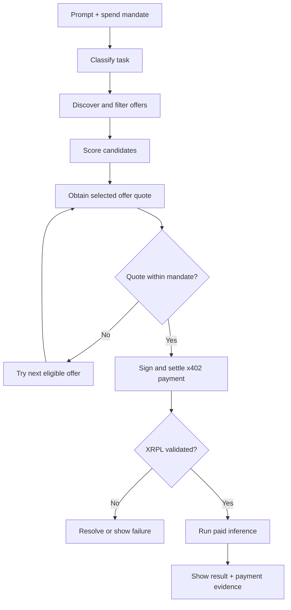
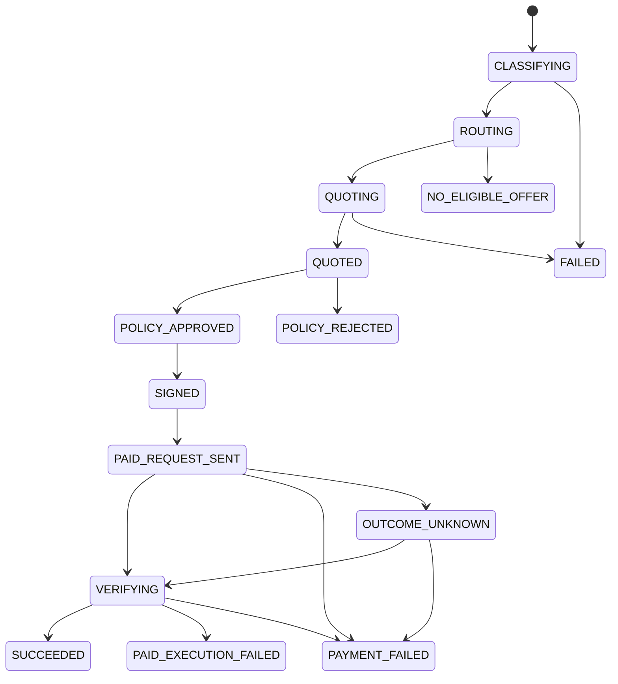
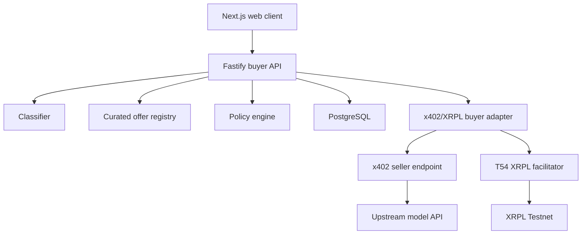

# Wallet-Native AI Inference Router

## Spec-Driven Product Requirements Document

| Field | Value |
| --- | --- |
| Status | Implementation-ready draft |
| Version | 1.0 |
| Date | 4 September 2026 |
| Delivery target | 24-hour hackathon MVP |
| Product surface | Web application |
| Blockchain | XRP Ledger Testnet |
| Default settlement asset | Testnet RLUSD |
| Fallback settlement asset | Testnet XRP, configuration-only change |
| Platform commission in MVP | Excluded |

---

## 1. How to Use This Specification

This document is the source of truth for the MVP. Development follows this order:

1. Change this specification.
2. Update the affected acceptance test.
3. Implement the smallest change that passes the test.
4. Record evidence that the acceptance criterion passed.

Every P0 behavior has a stable requirement ID. Pull requests and commits should reference the relevant IDs. If the implementation and this document disagree, this document wins until the specification is deliberately amended.

The words **MUST**, **MUST NOT**, **SHOULD**, and **MAY** are normative.

### 1.1 Evidence required for a P0 requirement

A P0 requirement is complete only when all of the following exist:

- implementation,
- automated test where practical,
- manual test instructions where automation is impractical,
- observable proof in the UI or logs,
- no unresolved blocker on the critical path.

---

## 2. Executive Summary

The product is a wallet-native AI client that selects an appropriate inference offer for each prompt, pays for the selected service on demand through x402, settles the payment on XRPL, and returns the purchased model response.

The user provides a need and a maximum spend. The agent:

1. classifies the task,
2. discovers available inference offers,
3. removes incompatible or over-budget offers,
4. scores the remaining offers by quality, cost, latency, and reliability,
5. obtains an authoritative x402 quote from the highest-ranked offer,
6. validates the quote against the user's mandate,
7. signs and settles an XRPL Testnet payment,
8. invokes the paid inference service, and
9. presents the answer, routing rationale, cost, and transaction evidence.

The MVP proves one claim:

> A user or agent can purchase the most suitable AI inference for a task without the user creating an account, maintaining credits, or supplying an API key to the chosen inference seller.

The MVP does **not** prove that API keys disappear from the entire supply chain. A seller may still use an upstream model provider credential behind its x402-protected endpoint, and the buyer holds one credential for prompt classification (DEC-014). The product replaces the buyer's per-seller provider credentials and prepaid balances with a wallet-backed purchase.

---

## 3. Product Thesis

### 3.1 Problem

An agent can decide which AI capability it needs, but access to that capability is normally pre-provisioned. A human must create provider accounts, fund balances, obtain API keys, and configure the agent before it can act.

That produces a mismatch:

```text
Dynamic agent decision
        +
Static commercial access
        =
Limited autonomy
```

### 3.2 Proposed change

Replace the buyer's provider-specific commercial relationship with a request-scoped payment:

```text
Need -> Discover -> Compare -> Authorise -> Pay -> Consume -> Verify
```

### 3.3 Positioning

Primary positioning:

> **One wallet. The right model for every task. Pay only when it is used.**

Technical positioning:

> A prompt-aware economic routing layer that selects an inference offer and purchases it through an x402 payment settled on XRPL.

The product MUST NOT be described as merely “OpenRouter on XRPL.” Its intended differentiation is buyer-controlled routing, inspectable decisions, request-scoped authorization, and direct settlement to an x402 seller.

---

## 4. Product Decisions

| ID | Decision | Rationale |
| --- | --- | --- |
| DEC-001 | Build a 24-hour hackathon MVP, not a production V1. | A complete commercial loop is more valuable than broad unfinished scope. |
| DEC-002 | Use a TypeScript-only web stack. The buyer API is Fastify; the seller is Express. | It reduces integration boundaries and aligns with `xrpl.js`. `x402-xrpl` (0.3.x) ships Express middleware and declares Express as a peer dependency, so the seller uses Express to get a working 402 gate without a hand-written adapter. |
| DEC-003 | Use XRPL Testnet. | The challenge repository recommends Testnet for prototyping and accepts Mainnet, Testnet, or Devnet. |
| DEC-004 | Default to Testnet RLUSD, with asset metadata supplied by environment configuration. | It preserves stable denomination and follows the supplied RLUSD faucet path without hard-coding an issuer. |
| DEC-005 | Support Testnet XRP through configuration, not a second code path. | It gives the team a demo fallback if RLUSD trust lines or facilitator support block progress. |
| DEC-006 | Use a pre-funded agent demo wallet whose seed exists only in backend environment secrets. | It enables autonomous payment within the hackathon window. This is an explicit prototype exception, not the production custody design. |
| DEC-007 | Remove the platform commission from the MVP. | A second payment adds atomicity and partial-failure problems without strengthening the core proof. |
| DEC-008 | Use a curated registry with at least three purchasable inference offers. | Dynamic marketplace discovery is not required to prove the core loop. |
| DEC-013 | Use the XRPL AI Hub at `https://xrpl-ai.org/` as the intended provider discovery source, at P1. | It is the live directory of x402 services on XRPL (1,700+ listed with XRP or RLUSD pricing). Its listings are Mainnet services and it publishes no documented machine-readable API, so a Testnet import would yield no eligible offers. The MVP routes over the curated registry and presents the hub in the demo and README as the market the product draws from. |
| DEC-014 | The buyer holds one provider credential for prompt classification. | Classification quality matters for the demo. The product thesis is scoped to purchasing inference without seller accounts, credits, or keys; it does not claim the buyer runs with zero provider credentials. The deterministic fallback (FR-011) keeps the flow demonstrable if that credential or model fails. |
| DEC-015 | The MVP surface is a human web UI only. | An autonomous-agent client (MCP tool or OpenAI-compatible API) is deferred to P1. Section 6.2 is aspirational for the MVP. |
| DEC-009 | Require at least one selected offer to complete a real x402/XRPL Testnet settlement and return real inference. | A simulated payment does not satisfy the challenge or product claim. |
| DEC-010 | Use advertised price estimates for comparison and the selected seller's x402 requirement as the authoritative price. | The initial 402 response is the enforceable quote. |
| DEC-011 | Never automatically buy a second offer after the first payment settles. | This prevents silent double-spend when paid execution fails. |
| DEC-012 | Show structured routing factors, not model chain-of-thought. | Users need evidence, not hidden reasoning traces. |

### 4.1 Assumption requiring later confirmation

DEC-006 is the selected default because the wallet-signing question was left unanswered. If the team chooses external user signing, the payment authorization and UI requirements must be revised before implementation.

---

## 5. Goals, Non-Goals, and Success Criteria

### 5.1 MVP goals

- Demonstrate a complete need-to-value commercial loop.
- Let the user provide a prompt and a maximum request cost.
- Compare at least three inference offers.
- Select an offer using a deterministic and inspectable scoring policy.
- Settle at least one real x402 payment on XRPL Testnet.
- Return useful output from the paid inference service.
- Expose the selected model, seller, amount, route reason, settlement state, and XRPL transaction hash.
- Prevent duplicate payment for the same quote.
- Produce a public repository that another developer can run from documented steps.

### 5.2 Non-goals for the MVP

The MVP MUST NOT include:

- a platform commission payment,
- Mainnet settlement,
- production custody claims,
- user accounts or social login,
- cross-chain settlement,
- MPP integration,
- learned routing,
- arbitrary API or tool purchasing,
- open provider self-registration,
- automatic provider benchmarking,
- treasury controls beyond the single wallet spend cap in SEC-011,
- browser extensions,
- an OpenAI-compatible public API,
- multi-agent wallets,
- subscription billing,
- refunds or escrow,
- decentralized governance,
- a custom x402 facilitator,
- a custom blockchain or token.

### 5.3 Demo success criteria

The demo passes only if all of the following happen in one uninterrupted flow:

1. The user enters a prompt and a maximum cost.
2. The UI displays a task classification.
3. The UI displays at least three considered offers.
4. The router selects one offer and explains the selection using structured factors.
5. The selected seller returns an x402 payment requirement.
6. The policy engine approves the exact amount, destination, network, asset, and expiry.
7. A real XRPL Testnet transaction reaches a validated successful state.
8. The paid seller returns a real inference result.
9. The UI displays the transaction hash and a working explorer link.
10. Repeating the execute request does not create another payment.

### 5.4 Challenge alignment

| Judging dimension | MVP evidence |
| --- | --- |
| Reachability | Seller-neutral offer contract and configurable settlement asset |
| Creativity | Prompt-aware economic routing rather than a fixed paywalled API |
| Feasibility | Narrow Testnet implementation with explicit production boundaries |
| Technical depth | Quote validation, invoice binding, idempotency, policy checks, and settlement verification |
| UX and design | Visible decision, cost, progress states, result, and ledger evidence |
| Builder feedback | Feedback hook evidence and final submitted feedback, handled in repository setup |

---

## 6. Users and Jobs to Be Done

### 6.1 Primary user: multi-model AI user

When I submit a task, I want the system to choose a suitable model within my budget so that I do not need to compare models, create provider accounts, or manage provider credits.

### 6.2 Secondary user: autonomous software agent (P1, not served by the MVP)

When my workflow needs inference, I want to discover and purchase an appropriate service under a spending mandate so that the workflow can continue without preconfigured credentials for every seller.

The MVP has no agent-facing client (DEC-015). The route and execute API in section 11 is the surface a P1 MCP tool or OpenAI-compatible adapter would wrap.

### 6.3 Supply-side user: inference seller

When I expose a model-backed service, I want to receive a request-scoped payment before computation so that I can sell inference without maintaining buyer accounts or balances.

### 6.4 User stories

| ID | User story | Priority |
| --- | --- | --- |
| US-001 | As a user, I can enter a text prompt and request budget. | P0 |
| US-002 | As a user, I can choose Balanced, Quality, Cheapest, or Fastest routing. | P0 |
| US-003 | As a user, I can see which offers were considered and why one was selected. | P0 |
| US-004 | As a user, I can authorize the agent to spend no more than the request budget. | P0 |
| US-005 | As a user, I can receive the result purchased from the selected seller. | P0 |
| US-006 | As a user, I can verify payment using an XRPL transaction hash. | P0 |
| US-007 | As a user, I receive a clear failure state without accidental duplicate payment. | P0 |
| US-008 | As a seller, my model is discoverable through a normalized offer record. | P0 |
| US-009 | As a seller, inference is not executed before payment validation. | P0 |
| US-010 | As a user, I can inspect historical completed routes. | P1 |

---

## 7. Core Experience



### 7.1 Request mandate

Pressing **Route and Run** authorizes one purchase subject to all of these constraints:

- exact prompt hash,
- maximum total provider payment,
- one allowed asset,
- XRPL Testnet only,
- registered sellers only,
- one successful payment maximum,
- mandate expiry of five minutes,
- no platform commission.

The agent MAY select any eligible offer within the mandate. A changed prompt, increased amount, changed asset, changed destination, expired mandate, or unregistered seller requires a new mandate.

### 7.2 Happy path

1. User enters a prompt, mode, and `maxCost`.
2. Client submits the route request.
3. Classifier returns a structured task profile.
4. Router loads active offers from the registry.
5. Router filters and scores offers.
6. Router sends the inference request to the highest-ranked seller.
7. Seller returns `402 Payment Required` without running inference.
8. Router validates the payment requirement and stores the immutable quote.
9. Policy engine confirms that the quote is within the request mandate.
10. Payment adapter builds and signs the XRPL `Payment` once; the signed blob and its locally computed hash are persisted before anything is sent.
11. Router resends the request with the `PAYMENT-SIGNATURE` header carrying the signed blob. This single call is the settlement trigger and the execution trigger.
12. Seller passes the payload to the facilitator, which verifies it and submits the transaction to XRPL.
13. Seller runs inference exactly once after the facilitator reports settlement, and returns the result with a `PAYMENT-RESPONSE` header carrying the transaction hash.
14. Router independently confirms the hash is validated with `tesSUCCESS` on the ledger and only then marks the payment `SETTLED`.
15. UI shows the answer and execution receipt.

The buyer never observes settlement before execution; both happen inside the seller's handling of step 11. Any retry of step 11 resends the identical signed blob and never re-signs.

---

## 8. Functional Requirements

### 8.1 Prompt and request mandate

#### FR-001: Submit route request — P0

The client MUST accept:

- a non-empty text prompt,
- a routing mode,
- a positive maximum cost expressed as a decimal string,
- an optional maximum output token count, forwarded to the seller as a generation limit. It does not affect filtering, scoring, or price; offers are priced per request.

Acceptance criteria:

- Every request carries the demo API key (SEC-011); requests without it return `UNAUTHORIZED` before any other processing.
- Empty or whitespace-only prompts return `VALIDATION_ERROR`.
- Prompts larger than 32,000 UTF-8 characters return `PROMPT_TOO_LARGE`.
- `maxCost` is parsed with decimal arithmetic, never a JavaScript floating-point number.
- The route record stores a SHA-256 prompt hash, not the prompt body.
- The route response includes an opaque route ID and an expiry timestamp.

#### FR-002: Request-scoped authorization — P0

The backend MUST construct a mandate containing the prompt hash, maximum cost, asset, network, allowed seller IDs, and expiry.

Acceptance criteria:

- A prompt whose hash differs at execution is rejected.
- An expired mandate is rejected before signing.
- A quote above `maxCost` is never signed.
- No commission or unrelated transfer is authorized.

### 8.2 Prompt classification

#### FR-010: Structured classification — P0

The classifier MUST return this shape:

```json
{
  "taskType": "coding",
  "reasoningLevel": "medium",
  "inputModality": "text",
  "estimatedInputTokens": 220,
  "requiredContextTokens": 4096,
  "toolCallingRequired": false,
  "confidence": 0.91
}
```

P0 task types:

- `general_chat`
- `coding`
- `mathematical_reasoning`
- `summarization`
- `extraction`
- `creative_writing`
- `long_context_analysis`

Acceptance criteria:

- The output is validated against a schema before use.
- Unknown or invalid output falls back to `general_chat`, `reasoningLevel=medium`, and `confidence=0`.
- Classification failure MUST NOT crash the route request.
- The classification model or deterministic fallback is identified in internal telemetry.
- The UI shows the task type and confidence, but not hidden chain-of-thought.

#### FR-011: Deterministic fallback classifier — P0

The system MUST include a local heuristic fallback so routing remains demonstrable if the classifier model fails.

Acceptance criteria:

- Code fences or programming keywords can classify as `coding`.
- Mathematical notation or proof keywords can classify as `mathematical_reasoning`.
- Summarize/summarise keywords can classify as `summarization`.
- All unmatched prompts classify as `general_chat`.

### 8.3 Offer registry and discovery

#### FR-020: Curated offer registry — P0

The system MUST load at least three active inference offers from a version-controlled configuration file or database seed.

Each offer MUST declare:

```json
{
  "offerId": "fast-text-v1",
  "sellerId": "seller-a",
  "displayName": "Fast Text",
  "modelId": "provider/model-name",
  "endpoint": "https://seller.example/infer/fast-text-v1",
  "payTo": "rExampleAddress",
  "network": "xrpl:<caip2-testnet-id>",
  "asset": {
    "code": "RLUSD",
    "currencyHex": "524C555344000000000000000000000000000000",
    "issuer": "rConfiguredIssuer",
    "decimals": 6
  },
  "capabilities": ["general_chat", "summarization", "extraction"],
  "contextWindow": 32768,
  "supportsTools": false,
  "advertisedPrice": "0.002",
  "p50LatencyMs": 1500,
  "reliability": 0.98,
  "qualityByTask": {
    "general_chat": 0.78,
    "summarization": 0.86,
    "extraction": 0.90
  },
  "enabled": true
}
```

Acceptance criteria:

- Invalid offer records fail application startup with a precise configuration error.
- `network` is the CAIP-2 identifier the x402 scheme expects (`xrpl:<id>`; the Testnet id is read from the `x402-xrpl` network constants, not hand-typed). The literal `xrpl:testnet` is not a valid wire value.
- Issued-currency codes longer than three characters, including RLUSD, are carried as the 40-hex currency code on the wire and shown as the human code only in the UI.
- Disabled offers never enter the candidate set.
- Seller destinations are allowlisted from the registry.
- Secrets and upstream provider API keys are not stored in registry records.
- The UI clearly labels registry prices as estimates until an x402 quote is obtained.

#### FR-021: Provider discovery via XRPL AI Hub — P1

The provider registry MUST be accessed through a `ProviderRegistry` interface (P0) so that a hub-backed implementation can be added without touching routing or UI. The MVP ships only `CuratedRegistry`, the version-controlled offer file from FR-020.

MVP treatment of the hub (P0, documentation only): the README and the demo narrative reference `https://xrpl-ai.org/` as the live XRPL x402 market the router is designed to draw offers from, and state that the curated registry stands in for it on Testnet because hub listings are Mainnet services.

P1 implementation, `XrplAiHubRegistry`: because the hub publishes no documented JSON API as of this draft, it MAY be a build-time import into `packages/config/hub-offers.json`; a live fetch is acceptable if a stable endpoint appears and MUST time out and fall back to the imported file.

Each discovered offer MUST be normalised into the FR-020 offer schema plus:

```json
{
  "source": "xrpl-ai-hub",
  "hubServiceId": "<hub identifier or listing URL>",
  "hubUrl": "https://xrpl-ai.org/<listing path>"
}
```

P1 acceptance criteria:

- Discovered offers pass the same schema validation as curated offers; an invalid hub record is skipped with a logged reason, never a startup failure.
- A hub-discovered seller never receives a prompt before the user has been shown its `source` and hub listing; unpaid quote requests to unvetted sellers are a privacy boundary (SEC-008 covers logs only).
- Only offers whose `network` is the configured Testnet CAIP-2 id and whose `asset` matches the configured settlement asset (RLUSD by default, XRP as the DEC-005 fallback) enter the candidate set. Mainnet-only hub listings are excluded under `APP_ENV=hackathon`.
- Discovered `endpoint` and `payTo` values become part of the allowlist only after validation (SEC-003). Raw hub data is never passed to `fetch` directly.
- The merged candidate set is `CuratedRegistry ∪ XrplAiHubRegistry`, deduplicated by `endpoint`. Curated fields win on conflict.
- The registry version hashes the merged set so identical inputs yield identical ordering (INV-010).
- If the hub import is empty or unreachable, routing proceeds on the curated registry alone and the UI shows a "hub discovery unavailable" notice.
- The UI labels each candidate with its `source` so the demo shows the agent choosing from hub-discovered sellers.

Discovery does NOT change the payment path: a hub-discovered seller is paid through the identical x402 quote and settlement flow as a curated one (FR-030 onward).

#### FR-022: Live hub refresh — P2

Refresh hub offers on a schedule or on demand without a redeploy, with the same validation as FR-021 and a stored registry version per refresh.

### 8.4 Candidate filtering

#### FR-030: Eligibility filtering — P0

The router MUST remove an offer when any condition is true:

- required task capability is absent,
- required context exceeds the offer's context window,
- required tool calling is unsupported,
- network differs from the configured network,
- asset differs from the mandate asset,
- seller or destination is not allowlisted,
- advertised estimated cost exceeds `maxCost`,
- offer is disabled.

Acceptance criteria:

- Every removed offer has one or more machine-readable rejection reasons.
- Rejected offers appear in the route details only as `ineligible`; they are never quoted or paid.
- If no offers remain, the route ends as `NO_ELIGIBLE_OFFER` before any payment operation.

### 8.5 Routing score

#### FR-040: Deterministic scoring — P0

Eligible offers MUST be scored using values normalized to `[0,1]`.

For candidate `c`:

```text
quality(c)     = qualityByTask[taskType], falling back to general_chat
cost(c)        = 1 - advertisedPrice(c) / maxEligiblePrice        (0 for the priciest eligible offer, approaching 1 for the cheapest)
latency(c)     = 1 - p50LatencyMs(c) / maxEligibleLatencyMs       (same normalisation over the eligible set)
reliability(c) = configured reliability

maxEligiblePrice and maxEligibleLatencyMs are taken over the eligible set only.
If the eligible set has one member, cost(c) = latency(c) = 1.

score(c) =
  wQuality * quality(c)
  + wCost * cost(c)
  + wLatency * latency(c)
  + wReliability * reliability(c)
```

Mode weights:

| Mode | Quality | Cost | Latency | Reliability |
| --- | ---: | ---: | ---: | ---: |
| Balanced | 0.45 | 0.30 | 0.15 | 0.10 |
| Quality | 0.70 | 0.10 | 0.10 | 0.10 |
| Cheapest | 0.15 | 0.65 | 0.10 | 0.10 |
| Fastest | 0.15 | 0.15 | 0.60 | 0.10 |

Mode guarantees, applied before the weighted score:

- `Cheapest` MUST select the lowest advertised price among eligible offers; the score orders only offers that share that price.
- `Fastest` MUST select the lowest `p50LatencyMs`; the score orders only ties.
- `Quality` and `Balanced` use the weighted score alone.

Tie-break order:

1. lower advertised price,
2. higher reliability,
3. lexicographically smaller `offerId`.

Acceptance criteria:

- The same inputs always produce the same ranking.
- Normalisation is relative to the eligible set, never to `maxCost`, so a generous budget does not flatten cost differences. A unit test asserts that with `maxCost` of `1.000000` and equal latencies, `Cheapest` still selects the lowest-priced offer.
- Weights sum to exactly `1.00`.
- Scores are stored to four decimal places.
- Unit tests cover every mode and tie-break rule.
- The selected reason is generated from structured score deltas, not free-form chain-of-thought.

#### FR-041: Routing explanation — P0

The system MUST return:

- detected task type,
- selected offer,
- mode,
- normalized factor values,
- final score,
- estimated price,
- authoritative quoted price when available,
- a one- or two-sentence explanation.

Example:

> Selected Fast Code because it had the highest Balanced score for a coding task. It was estimated to cost 58% less than the highest-quality eligible offer while remaining within 6 percentage points of its coding quality score.

The explanation MUST NOT claim empirical superiority unless the score source is documented.

### 8.6 x402 quote acquisition

#### FR-050: Obtain authoritative quote — P0

The router MUST send the protected request to the highest-ranked eligible seller and expect either:

- a valid `402 Payment Required`, or
- a documented error.

The seller MUST NOT invoke the upstream model before payment verification.

Acceptance criteria:

- A `200` response before payment is treated as seller misconfiguration and is not presented as a paid execution.
- The payment requirement is stored immutably with its invoice identifier (`extra.invoiceId`), `maxTimeoutSeconds`, and the resulting expiry.
- The prompt is sent only to sellers present in the curated registry. Because the unpaid request carries the full prompt, registry membership is the trust boundary for prompt disclosure.
- The quote amount is treated as authoritative over the registry estimate.
- The request body is sent only to the currently selected seller, not to every candidate.

#### FR-051: Quote validation — P0

Before signing, the router MUST validate:

- scheme is `exact`,
- `network` equals the configured Testnet CAIP-2 identifier,
- `asset` equals `XRP` or the configured 40-hex currency code, and `extra.issuer` equals the configured issuer for issued currencies,
- `payTo` exactly matches the registry destination,
- `extra.invoiceId` present and not previously seen,
- positive amount,
- amount less than or equal to `maxCost`,
- invoice identifier present,
- quote not expired,
- request or resource binding present,
- no unsupported partial payment or path-payment behavior.

Acceptance criteria:

- Any mismatch produces `QUOTE_REJECTED` with a safe public reason.
- A quote is never silently modified.
- If a selected quote exceeds the budget, that offer is marked `quote_over_budget` and the router MAY try the next eligible unpaid offer.
- Trying the next offer before any settlement does not require a new mandate if it remains within the original constraints.

### 8.7 Spending policy

#### FR-060: Pre-signing policy gate — P0

The policy engine MUST approve the quote before wallet access is requested.

It MUST verify:

- route is in `QUOTED` state,
- mandate is active,
- wallet balance is sufficient,
- network and asset match configuration,
- seller and destination are allowlisted,
- amount is within the mandate,
- no payment exists for the quote or route,
- quote expiry leaves enough time to submit.

Acceptance criteria:

- A rejected policy evaluation never calls the signer.
- The evaluation stores structured pass/fail checks.
- The UI shows a concise rejection reason.

### 8.8 XRPL/x402 payment

#### FR-070: Build and sign payment — P0

The payment adapter MUST build a payer-signed XRPL `Payment` transaction that exactly matches the validated x402 requirement.

Invoice binding uses the `InvoiceID` field set to the SHA-256 of `extra.invoiceId` (the scheme's Method B). The memo method is not used. The transaction MUST carry a bounded `LastLedgerSequence`, the scheme's default `SourceTag`, and MUST NOT set the partial-payment flag or any `Paths`.

Signing is serialised per wallet: one signing operation at a time, so two concurrent routes cannot take consecutive `Sequence` numbers where the second depends on a seller forwarding the first. Tickets are the P1 upgrade if throughput matters.

Acceptance criteria:

- Wallet seed is read from an environment secret only at signing time.
- Wallet seed is never returned, logged, serialized, or persisted.
- Destination, amount, asset, issuer, invoice binding, and network are revalidated immediately before signing.
- The signed blob and its locally computed transaction hash are persisted in the Payment record before the paid request is sent, so a lost response can be resolved by hash.
- The signed transaction blob is sent only in the `PAYMENT-SIGNATURE` header of the paid request to the selected seller.

#### FR-071: Idempotent purchase — P0

The system MUST guarantee at most one submitted payment transaction per immutable quote.

Implementation invariant:

```text
UNIQUE(route_id)
UNIQUE(invoice_id)
UNIQUE(transaction_hash) where transaction_hash is not null
```

Acceptance criteria:

- Concurrent execute calls for one route result in one signed transaction and one paid request in flight.
- A repeated execute call returns the existing execution or its current state.
- A quote is signed at most once. If the paid request times out or its response is lost, the system first queries the ledger for the persisted hash; if absent and `LastLedgerSequence` has not passed, it MAY resend the identical blob; it never produces a new signature for the same quote.
- The system never creates a new transaction merely because the HTTP response was lost.

#### FR-072: Settlement verification — P0

The system MUST mark payment `SETTLED` only after it has evidence that the XRPL transaction is validated with a successful result.

Acceptance criteria:

- A facilitator acknowledgment without ledger success is not sufficient for `SETTLED`.
- The stored receipt includes transaction hash, ledger index when available, destination, amount, asset, and validation timestamp.
- The explorer link is derived from a configured Testnet explorer base URL and the stored hash.

### 8.9 Paid inference execution

#### FR-080: Release service after payment — P0

After payment verification, the seller MUST invoke the configured upstream model and return a normalized response.

```json
{
  "requestId": "req_123",
  "offerId": "fast-code-v1",
  "modelId": "provider/model-name",
  "content": "...",
  "usage": {
    "inputTokens": 220,
    "outputTokens": 640
  },
  "providerLatencyMs": 1840
}
```

Acceptance criteria:

- Upstream API keys exist only in seller-side environment secrets.
- The seller invokes the upstream model no more than once per invoice ID.
- A repeated paid request returns the cached result or resumes the same execution without another payment.
- The buyer receives a normalized error if the upstream model fails.

#### FR-081: Paid execution failure — P0

If settlement succeeds but inference fails, the route MUST enter `PAID_EXECUTION_FAILED`.

Acceptance criteria:

- The system does not automatically purchase another offer.
- The UI states that payment succeeded but service delivery failed.
- Retry against the same seller MAY reuse the existing paid entitlement if the seller supports idempotent replay.
- A new purchase requires explicit user action and a new route.

#### FR-082: Response handling — P0

The MVP MAY return the final response non-streamingly. It MUST stream or poll execution state changes so the user can see classification, selection, payment, settlement, and execution progress.

Token-level response streaming is P1.

### 8.10 Auditability and UI

#### FR-090: Execution receipt — P0

Every completed or failed route MUST expose a receipt containing:

- route ID,
- prompt hash,
- task classification,
- routing mode,
- candidates and eligibility states,
- selected offer and score factors,
- registry estimate,
- authoritative quote,
- policy decision,
- payment status,
- transaction hash and explorer link when submitted,
- execution status and latency,
- timestamps.

The receipt MUST NOT include wallet seeds, upstream API keys, raw signed transaction blobs, or hidden model reasoning.

#### FR-091: Main chat interface — P0

The main page MUST include:

- prompt input,
- routing mode selector,
- maximum cost input with asset label,
- **Route and Run** action,
- current wallet balance,
- progress timeline,
- selected offer card,
- final answer or error state.

#### FR-092: Candidate comparison — P0

The route details MUST distinguish:

- `eligible`,
- `ineligible`,
- `selected`,
- `quote_rejected`,
- `not_quoted`.

Estimated and quoted prices MUST use different labels. The UI MUST NOT imply that unquoted candidates supplied authoritative prices.

#### FR-093: Payment evidence — P0

After transaction submission, the UI MUST show:

- pending or validated status,
- amount and asset,
- seller name,
- shortened transaction hash,
- copy action,
- explorer link.

No router fee row may appear in the MVP.

---

## 9. State Machines and Invariants

### 9.1 Route states



`PAID_REQUEST_SENT` covers the seller call that both settles and executes. `VERIFYING` is the buyer's independent ledger check of the hash from `PAYMENT-RESPONSE` (or the locally computed hash if the response was lost). `SUCCEEDED` requires a validated `tesSUCCESS` and a model result; `PAID_EXECUTION_FAILED` requires a validated `tesSUCCESS` and no result. If the ledger shows no such transaction after `LastLedgerSequence` has passed, the route is `PAYMENT_FAILED` and no money moved.

### 9.2 Payment states

```text
NOT_CREATED
-> CREATED
-> SIGNED            (blob + hash persisted; the only signing event)
-> SENT              (blob handed to the seller in PAYMENT-SIGNATURE)
-> SETTLED           (buyer saw tesSUCCESS in a validated ledger)

Failure branches:
CREATED -> POLICY_REJECTED
SENT    -> VALIDATED_FAILED   (tec/tef/tem result, or expired past LastLedgerSequence with no ledger entry)
SENT    -> OUTCOME_UNKNOWN    (seller/facilitator response lost; resolve by hash, never re-sign)
```

The facilitator, not the buyer, submits to XRPL. The buyer's replay protection is the account `Sequence` inside the signed blob: resending the same blob cannot apply twice, and a fresh signature is never produced for an existing quote.

### 9.3 Hard invariants

| ID | Invariant |
| --- | --- |
| INV-001 | No upstream inference before payment verification. |
| INV-002 | No signing before policy approval. |
| INV-003 | No more than one submitted payment per invoice or route. |
| INV-004 | A settled route cannot be automatically rerouted to a newly paid offer. |
| INV-005 | Quoted amount, asset, destination, network, and invoice binding are immutable. |
| INV-006 | Money is represented as decimal strings or arbitrary-precision decimal values, never binary floating point. |
| INV-007 | The wallet seed and upstream credentials never leave server-side secret storage. |
| INV-008 | The MVP sends no platform commission payment. |
| INV-009 | Only a validated successful XRPL result can produce `SETTLED`. |
| INV-010 | The same routing inputs and registry version produce the same candidate ordering. |
| INV-011 | A quote is signed at most once. Retries resend the identical signed blob; a new signature for an existing quote is never produced. |
| INV-012 | The buyer API never signs without a valid demo API key and an unexhausted hourly spend cap. |

---

## 10. System Architecture



### 10.1 Recommended repository layout

```text
apps/
  web/                 Next.js UI
  api/                 Fastify router and buyer
  seller/              x402-protected inference seller (Express + x402-xrpl)
packages/
  contracts/           shared schemas and API types
  routing/             classifier, filtering, scoring
  payments/            x402/XRPL adapter
  database/            Prisma schema and client
  config/              offer registry and runtime validation
tests/
  unit/
  integration/
  e2e/
```

The seller may run in the same process during local development, but buyer and seller MUST remain separate modules with separate secret sets and explicit HTTP interaction. The architecture MUST NOT call the seller implementation directly in process, because that would bypass the x402 commercial boundary.

### 10.2 Stack

| Layer | Selection |
| --- | --- |
| Language | TypeScript with strict mode |
| Runtime | Node.js 20 or later |
| Package manager | pnpm |
| Frontend | Next.js, React, Tailwind CSS |
| Buyer API | Fastify |
| Seller | Express, using the `x402-xrpl` middleware (DEC-002) |
| Validation | Zod or equivalent runtime schema validation |
| Database | PostgreSQL with Prisma |
| XRPL | `xrpl.js` behind a local adapter |
| x402/XRPL | `x402-xrpl` or challenge-supported equivalent behind a local adapter |
| Decimal arithmetic | `decimal.js` or equivalent |
| Tests | Vitest plus Playwright |
| Structured logging | Pino with redaction |

### 10.3 Adapter boundaries

The codebase MUST define these interfaces:

```ts
interface Classifier {
  classify(input: ClassifyInput): Promise<TaskProfile>;
}

interface ProviderRegistry {
  listActiveOffers(): Promise<InferenceOffer[]>;
}

interface PaymentClient {
  obtainRequirement(request: SellerRequest): Promise<PaymentRequirement>;
  payAndRetry(input: PayAndRetryInput): Promise<PaidSellerResponse>;
  resolveTransaction(hash: string): Promise<SettlementResult>;
}

interface WalletSigner {
  getAddress(): Promise<string>;
  signExactPayment(input: ExactPayment): Promise<SignedPayment>;
}
```

External SDK types MUST NOT leak beyond their adapter packages. This allows the team to replace evolving hackathon SDKs without rewriting routing or UI logic.

---

## 11. API Contract

All endpoints use JSON, UTC ISO-8601 timestamps, opaque IDs, and a standard error envelope.

### 11.1 Standard error

```json
{
  "error": {
    "code": "QUOTE_REJECTED",
    "message": "The selected seller quote exceeded the request budget.",
    "retryable": true,
    "routeId": "route_123"
  }
}
```

Public messages MUST be safe to display. Internal stack traces and raw provider payloads MUST NOT be returned.

### 11.2 `POST /v1/routes`

Creates, classifies, filters, scores, and quotes a route. It does not pay.

Request:

```json
{
  "prompt": "Implement Dijkstra's algorithm and explain its complexity.",
  "mode": "balanced",
  "maxCost": "0.020000",
  "maxOutputTokens": 1200
}
```

The settlement asset is server configuration (DEC-004, DEC-005) and is not a request field. Requests carry `Authorization: Bearer <demo api key>` (SEC-011).

```json
```

Response `201`:

```json
{
  "routeId": "route_123",
  "state": "QUOTED",
  "expiresAt": "2026-09-04T18:05:00Z",
  "taskProfile": {
    "taskType": "coding",
    "reasoningLevel": "medium",
    "inputModality": "text",
    "estimatedInputTokens": 15,
    "requiredContextTokens": 4096,
    "toolCallingRequired": false,
    "confidence": 0.94
  },
  "selected": {
    "offerId": "fast-code-v1",
    "sellerName": "Demo Seller B",
    "modelId": "provider/model-b",
    "score": "0.8612",
    "estimatedCost": "0.006000",
    "quotedCost": "0.006200",
    "asset": "RLUSD",
    "reason": "Highest Balanced score for a coding task within the request budget."
  },
  "candidates": [],
  "mandate": {
    "maxCost": "0.020000",
    "network": "xrpl:<caip2-testnet-id>",
    "asset": "RLUSD",
    "expiresAt": "2026-09-04T18:05:00Z"
  }
}
```

### 11.3 `POST /v1/routes/:routeId/execute`

Re-supplies the prompt, validates its hash, approves policy, pays, and executes.

Request:

```json
{
  "prompt": "Implement Dijkstra's algorithm and explain its complexity."
}
```

Response `202`:

```json
{
  "routeId": "route_123",
  "state": "PAYMENT_PENDING",
  "statusUrl": "/v1/routes/route_123",
  "eventsUrl": "/v1/routes/route_123/events"
}
```

The endpoint is idempotent by `routeId`. A repeated request returns the existing state and MUST NOT submit a second transaction.

### 11.4 `GET /v1/routes/:routeId`

Returns the current route, candidate evidence, payment receipt, and final result when available.

### 11.5 `GET /v1/routes/:routeId/events`

Returns Server-Sent Events for state changes.

Event types:

- `route.state_changed`
- `payment.submitted`
- `payment.validated`
- `execution.started`
- `execution.completed`
- `route.failed`

Every event includes `routeId`, `eventId`, `timestamp`, and a state-specific payload.

### 11.6 `GET /v1/offers`

Returns the public, secret-free offer registry and current enabled state.

### 11.7 `GET /v1/wallet`

Returns only:

```json
{
  "address": "rExample",
  "network": "xrpl:<caip2-testnet-id>",
  "balances": [
    { "asset": "RLUSD", "amount": "5.000000" },
    { "asset": "XRP", "amount": "25.000000" }
  ]
}
```

### 11.8 Seller endpoint: `POST /v1/inference/:offerId`

First unpaid request:

- validates request shape,
- creates or retrieves an invoice bound to `requestId`, `offerId`, and prompt hash,
- returns `402 Payment Required`,
- does not call the upstream model.

Paid retry:

- verifies payment through the facilitator flow,
- resolves invoice idempotently,
- runs or retrieves the upstream execution,
- returns the normalized model response and payment response metadata.

---

## 12. Data Model

### 12.1 Route

| Field | Type | Notes |
| --- | --- | --- |
| `id` | UUID/string | Opaque public ID |
| `promptHash` | string | SHA-256; prompt body is not persisted |
| `mode` | enum | balanced, quality, cheapest, fastest |
| `maxCost` | decimal | Stored as fixed precision |
| `assetCode` | string | RLUSD or XRP |
| `network` | string | Configured Testnet CAIP-2 id |
| `registryVersion` | string | Hash or version of offers used |
| `taskProfile` | JSON | Schema-validated structured output |
| `selectedOfferId` | string/null | Immutable after quote acceptance |
| `state` | enum | Route state machine |
| `expiresAt` | timestamp | Mandate expiry |
| `createdAt` | timestamp | UTC |
| `updatedAt` | timestamp | UTC |

### 12.2 RouteCandidate

| Field | Type | Notes |
| --- | --- | --- |
| `routeId` | foreign key | Composite unique with offer ID |
| `offerId` | string | Registry offer |
| `eligibility` | enum | eligible/ineligible/selected/quote_rejected/not_quoted |
| `rejectionReasons` | JSON array | Machine-readable codes |
| `qualityScore` | decimal | 0–1 |
| `costScore` | decimal | 0–1 |
| `latencyScore` | decimal | 0–1 |
| `reliabilityScore` | decimal | 0–1 |
| `finalScore` | decimal | 0–1 |
| `estimatedCost` | decimal | Registry estimate |

### 12.3 Quote

| Field | Type | Notes |
| --- | --- | --- |
| `id` | UUID/string | Internal quote ID |
| `routeId` | unique foreign key | One accepted quote per route |
| `invoiceId` | unique string | Replay and purchase binding |
| `sellerId` | string | Registry seller |
| `offerId` | string | Selected offer |
| `destination` | string | Exact XRPL address |
| `amount` | decimal | Immutable |
| `assetCode` | string | Immutable |
| `assetIssuer` | string/null | Required for issued currency |
| `network` | string | Immutable |
| `rawRequirementHash` | string | Hash, not necessarily raw payload |
| `expiresAt` | timestamp | Quote expiry |

### 12.4 Payment

| Field | Type | Notes |
| --- | --- | --- |
| `id` | UUID/string | Internal payment ID |
| `routeId` | unique foreign key | Enforces one purchase per route |
| `quoteId` | unique foreign key | Enforces one purchase per quote |
| `invoiceId` | unique string | Enforces replay protection |
| `payerAddress` | string | Public XRPL address |
| `destination` | string | Seller address |
| `amount` | decimal | Exact paid amount |
| `assetCode` | string | RLUSD or XRP |
| `transactionHash` | unique string/null | Available after signing/submission |
| `status` | enum | Payment state machine |
| `ledgerIndex` | integer/null | Validation evidence |
| `validatedAt` | timestamp/null | Validation evidence |
| `failureCode` | string/null | Safe internal code |

### 12.5 Execution

| Field | Type | Notes |
| --- | --- | --- |
| `id` | UUID/string | Internal execution ID |
| `routeId` | unique foreign key | One selected execution |
| `invoiceId` | unique string | Seller idempotency key |
| `offerId` | string | Purchased offer |
| `modelId` | string | Actual model used |
| `status` | enum | pending/running/succeeded/failed |
| `inputTokens` | integer/null | Usage when available |
| `outputTokens` | integer/null | Usage when available |
| `latencyMs` | integer/null | Provider execution latency |
| `result` | text/null | Demo retention only; see security section |
| `failureCode` | string/null | Normalized error |

---

## 13. UI Specification

### 13.1 Single-page layout

The MVP uses one primary page with four regions:

1. **Wallet bar**: address, network badge, RLUSD/XRP balances.
2. **Prompt composer**: prompt, mode, maximum cost, output limit, action button.
3. **Execution timeline**: classify, compare, quote, approve, settle, execute.
4. **Result workspace**: model answer and collapsible economic receipt.

### 13.2 UI states

| State | Required presentation |
| --- | --- |
| Idle | Empty composer and wallet readiness |
| Classifying | Task analysis progress |
| Routing | Candidate count and filtering progress |
| Quoting | Selected seller quote pending |
| Quoted | Selection, rationale, quoted amount, mandate |
| Payment pending | Amount, seller, network, pending indicator |
| Settled | Validated indicator and transaction hash |
| Executing | Selected model and elapsed time |
| Succeeded | Answer plus complete receipt |
| Failed before payment | Failure reason and safe retry action |
| Paid execution failed | Prominent warning that payment succeeded; no automatic reroute |

### 13.3 Candidate table

| Offer | Task quality | Price | Latency | Reliability | Score | Status |
| --- | ---: | ---: | ---: | ---: | ---: | --- |
| Fast Code | 0.90 | 0.006 estimated / 0.0062 quoted | 1.8 s | 98% | 0.8612 | Selected |
| Deep Reasoning | 0.97 | 0.018 estimated | 4.5 s | 99% | 0.8021 | Not quoted |
| Cheap Text | 0.70 | 0.002 estimated | 1.1 s | 97% | 0.7415 | Eligible |

The UI MUST use `estimated` and `quoted` labels exactly enough to prevent ambiguity.

### 13.4 Error copy rules

- State what failed.
- State whether money moved.
- State whether retrying can create another payment.
- Do not expose stack traces or raw settlement payloads.
- Do not claim a refund unless one was actually executed.

Example:

> Payment was validated, but the seller could not complete inference. No second provider was purchased. You can retry delivery from the same seller without creating a new payment if the paid entitlement remains valid.

---

## 14. Failure Handling

| Failure | Required behavior | Automatic retry? |
| --- | --- | --- |
| Classifier unavailable | Use deterministic fallback | Yes |
| No eligible offer | Stop before quote/payment | No |
| Selected seller unavailable before payment | Try next eligible unpaid offer | Yes, bounded to remaining candidates |
| Invalid 402 requirement | Reject quote; try next unpaid offer | Yes |
| Quote above budget | Reject quote; try next unpaid offer | Yes |
| Insufficient balance | Stop before signing | No |
| Signer unavailable | Stop; payment not submitted | No |
| Seller or facilitator rejects the paid request | Record failure; check the persisted hash on ledger before marking money as not moved | Only outcome resolution |
| Paid request response lost | Query the ledger for the persisted hash; if absent and `LastLedgerSequence` not passed, MAY resend the identical blob | Never sign again |
| Facilitator (best-effort Testnet service) is down | Route ends `PAYMENT_FAILED` if the hash never appears on ledger; UI says no money moved | No |
| Ledger validates failure | Mark payment failed | No |
| Seller times out after settlement | Mark `PAID_EXECUTION_FAILED`; retry same entitlement only | Same seller only |
| Upstream model fails after settlement | Mark `PAID_EXECUTION_FAILED` | Same seller only |
| Client disconnects | Continue server execution; allow status retrieval | Not applicable |

Retries before payment MUST be capped at the number of remaining eligible offers. Network polling MUST use bounded exponential backoff.

---

## 15. Security and Privacy Requirements

### 15.1 Prototype security boundary

The MVP uses a server-controlled Testnet agent wallet. This is acceptable only because:

- the wallet contains no real-value funds,
- the seed is stored in environment secrets,
- per-request policy checks occur before signing,
- destinations are allowlisted,
- the application runs on XRPL Testnet,
- the UI and documentation explicitly label it a demo wallet.

The MVP MUST NOT be described as production non-custodial architecture.

### 15.2 Required controls

| ID | Control |
| --- | --- |
| SEC-001 | Redact keys matching seed, secret, token, authorization, payment-signature, and API-key patterns from logs. |
| SEC-002 | Never store raw wallet seeds or upstream API keys in source control or the database. |
| SEC-003 | Validate every external URL against the registry; block arbitrary user-supplied endpoints. |
| SEC-004 | Set outbound HTTP timeouts and response-size limits. |
| SEC-005 | Revalidate payment fields immediately before signing. |
| SEC-006 | Bind invoice, offer, request, and prompt hash to prevent cross-resource reuse. |
| SEC-007 | Use database uniqueness and locking for payment idempotency. |
| SEC-008 | Do not log full prompts or model responses by default. |
| SEC-009 | Do not expose raw signed transactions through public APIs. |
| SEC-010 | Reject Mainnet configuration when `APP_ENV=hackathon`. |
| SEC-011 | The buyer API requires a demo API key on every route and execute call, and enforces a configured cap on total wallet spend per rolling hour. The deployed demo is otherwise an unauthenticated endpoint that can drain the agent wallet. Exceeding the cap returns `SPEND_CAP_REACHED` before signing. |

### 15.3 Data retention

- The buyer stores the prompt hash, not the prompt body.
- The client resubmits the prompt for execution; the backend checks the hash.
- Model results MAY be stored for the demo session and MUST be purgeable.
- Telemetry stores task type and operational metrics, not prompt content.
- A production version requires encrypted content storage or a no-retention execution design.

### 15.4 Production direction

Production should replace the demo wallet with client-side or delegated policy-gated signing, such as an XRPL-compatible open wallet standard. That work is outside P0 and cannot be claimed as implemented.

---

## 16. Non-Functional Requirements

| ID | Requirement | Target |
| --- | --- | --- |
| NFR-001 | Route computation excluding external quote | p95 under 2 seconds |
| NFR-002 | UI feedback after action | first state update under 300 ms |
| NFR-003 | Payment outcome | visible until terminal; no false success |
| NFR-004 | API availability during demo | survives one seller failure and one classifier failure |
| NFR-005 | Determinism | identical routing input + registry version yields identical rank |
| NFR-006 | Observability | every route has correlated state events and normalized errors |
| NFR-007 | Accessibility | keyboard-operable core flow and readable status text |
| NFR-008 | Responsiveness | usable at 360 px width and desktop widths |
| NFR-009 | Configuration safety | startup fails on missing network, asset, issuer, facilitator, wallet, or seller secrets |
| NFR-010 | Reproducibility | clean setup reaches a smoke test from documented commands |

XRPL settlement and model inference latency are external and are not included in the two-second routing target.

---

## 17. Acceptance Test Suite

### AT-001: Successful balanced route

```gherkin
Given the registry contains three active RLUSD Testnet offers
And the agent wallet has sufficient RLUSD and XRP reserve/fees
When the user submits a coding prompt with mode "balanced" and maxCost "0.020000"
Then the router classifies the task
And ranks all eligible offers deterministically
And obtains a valid x402 quote from the highest-ranked offer
And the quote passes policy validation
And exactly one XRPL payment is submitted
And the transaction reaches validated success
And the selected seller returns a model response
And the UI shows the answer, quoted cost, seller, reason, and transaction hash
```

### AT-002: No offer within budget

```gherkin
Given every active offer has an advertised price above "0.001000"
When the user submits maxCost "0.001000"
Then the route ends with NO_ELIGIBLE_OFFER
And the signer is not called
And no payment record is created
```

### AT-003: Authoritative quote exceeds estimate

```gherkin
Given the selected offer is estimated at "0.006000"
And its x402 quote is "0.021000"
And the user maxCost is "0.020000"
When the quote is validated
Then the quote is rejected
And no payment is signed for that offer
And the router tries the next eligible unpaid offer
```

### AT-004: Destination substitution attack

```gherkin
Given the registry seller destination is address A
And the received payment requirement uses address B
When the policy engine validates the quote
Then the route fails with QUOTE_REJECTED
And the wallet signer is not called
```

### AT-005: Duplicate execute calls

```gherkin
Given a quoted route
When two execute requests arrive concurrently for the same route
Then at most one payment transaction is submitted
And both callers observe the same route and payment state
```

### AT-006: Lost submission response

```gherkin
Given a signed transaction was submitted
And the HTTP response was lost
When the execution worker resumes
Then it resolves the known transaction outcome
And it does not create or sign a replacement payment
```

### AT-007: Paid execution failure

```gherkin
Given the payment is validated successfully
And the upstream model fails
When the seller returns an execution error
Then the route becomes PAID_EXECUTION_FAILED
And the UI states that payment succeeded
And the router does not purchase another offer
```

### AT-008: Classifier failure

```gherkin
Given the LLM classifier is unavailable
When the user submits a prompt containing a code block
Then the fallback classifier returns coding
And routing continues
And no payment behavior changes
```

### AT-009: Prompt mutation

```gherkin
Given a route was quoted for prompt hash A
When execute is called with a prompt producing hash B
Then execution is rejected
And no signing or payment occurs
```

### AT-010: Commission exclusion

```gherkin
Given any successful MVP route
When its payment records and XRPL transactions are inspected
Then exactly one commercial payment exists for the selected seller
And no router-fee payment exists
And no commission is included in the displayed total
```

### AT-011: Explorer evidence

```gherkin
Given a payment reached validated success
When the user opens the transaction link
Then the configured XRPL Testnet explorer displays the same transaction hash
And the destination and asset amount match the execution receipt
```

### AT-012: Seller payment gate

```gherkin
Given an unpaid inference request
When it reaches a seller endpoint
Then the seller returns 402 Payment Required
And the upstream model invocation count remains zero
When the same request is retried with a valid payment
Then the upstream model invocation count becomes one
```

---

## 18. Test Strategy

### 18.1 Unit tests

Required:

- task profile schema parsing,
- fallback classification,
- capability filtering,
- context filtering,
- every routing mode,
- all tie-break rules,
- decimal cost comparison,
- quote-field validation,
- mandate expiry,
- route state transitions,
- safe public error mapping.

### 18.2 Integration tests

Required:

- router to seller unpaid 402 flow,
- valid paid retry using a test fixture or facilitator sandbox,
- database uniqueness under concurrent execute calls,
- seller idempotency by invoice ID,
- transaction outcome resolution,
- upstream model failure after payment.

### 18.3 End-to-end tests

Required before submission:

- one mocked no-payment route test for fast CI,
- one live Testnet happy-path smoke test run manually,
- one live transaction hash captured as evidence,
- one duplicate-execute test against the deployed demo.

Live Testnet tests MUST NOT run on every CI commit.

---

## 19. Observability

Every log and event MUST carry:

- `routeId`,
- `requestId`,
- `invoiceId` when created,
- `offerId` when selected,
- `transactionHash` when known,
- normalized state,
- timestamp.

Required metrics:

- routes created,
- routes completed,
- no-eligible-offer count,
- quote rejection count by reason,
- payment success/failure/unknown count,
- paid execution failure count,
- route latency,
- settlement latency,
- provider latency,
- selected-offer distribution.

Prompts, responses, secrets, authorization headers, raw payment signatures, and signed transaction blobs MUST be redacted.

---

## 20. One-Day Delivery Plan

### Critical path

```text
Seller 402 gate
-> Buyer payment adapter
-> Real XRPL Testnet settlement
-> Paid inference
-> Router
-> UI and evidence
```

Nothing outranks the first real end-to-end paid inference.

| Window | Deliverable | Exit condition |
| --- | --- | --- |
| Hours 0–2 | Repository, runtime config, Testnet wallets, asset trust lines, health endpoints | Buyer and seller start; balances visible |
| Hours 2–5 | One x402-protected seller offer | Unpaid request returns valid 402; no inference runs |
| Hours 5–8 | Buyer payment adapter | One real Testnet payment validates and paid retry succeeds |
| Hours 8–11 | Three-offer registry behind `ProviderRegistry`, classifier, filtering, scoring | Deterministic selected offer with unit tests, including the Cheapest-mode guarantee |
| Hours 11–14 | Route and execute APIs with state persistence | Full API flow works without UI |
| Hours 14–17 | Main web experience and execution timeline | User can complete the full flow visually |
| Hours 17–20 | Idempotency, quote validation, failure states | Duplicate execution and invalid quote tests pass |
| Hours 20–22 | Demo script, explorer evidence, README, architecture | Fresh setup and demo rehearsal pass |
| Hours 22–24 | Buffer and polish | No P0 blocker; final submission artifacts complete |

### 20.1 Cut order if behind schedule

Cut in this order:

1. history page,
2. token-level response streaming,
3. custom mode weights,
4. wallet analytics,
5. any P1 hub discovery work that crept in (FR-021),
6. provider health dashboards,
7. any second settlement asset.

Never cut:

- real XRPL transaction,
- x402 payment gate,
- agent selection among multiple offers,
- useful paid output,
- transaction evidence,
- duplicate-payment protection.

---

## 21. Definition of Done

The MVP is done when:

- all P0 functional requirements are implemented or explicitly waived in this document,
- AT-001 through AT-012 pass or have recorded manual evidence,
- at least one successful XRPL Testnet transaction hash is recorded,
- the paid seller returns real inference,
- duplicate execute requests do not create duplicate payment,
- secrets are absent from the repository and logs,
- the public repository includes setup instructions,
- the repository includes an architecture diagram,
- environment variables are documented using non-secret examples,
- a new developer can run the mocked smoke test,
- the demo can be completed from a clean browser session,
- the builder feedback requirement is completed,
- the demo and README make clear that the wallet is a Testnet agent demo wallet,
- no platform commission is executed or displayed.

---

## 22. Demo Script

### 22.1 Setup

- Show the XRPL Testnet badge.
- Show the funded agent wallet balance.
- Show the four routing modes and maximum-cost control.

### 22.2 Prompt

Use a task with a visible reason to prefer a mid-tier model:

> Explain this distributed database query plan and identify the most expensive operation. Keep the answer under 500 words.

Set mode to **Balanced** and maximum cost to `0.020000 RLUSD`.

### 22.3 Agent decision

Show:

- classification: technical reasoning or long-context analysis,
- three considered offers,
- one excluded or lower-ranked alternative,
- selected offer score factors,
- estimated price and authoritative quote.

### 22.4 Commercial loop

Narrate only observable actions:

1. Seller requested payment.
2. Policy confirmed the quote was within the mandate.
3. Agent signed one exact Testnet payment.
4. XRPL validated it.
5. Seller released the purchased inference.

### 22.5 Evidence

- Show the useful result.
- Expand the economic receipt.
- Open the transaction in the Testnet explorer.
- Repeat the execute request or refresh the page to show that no second payment occurs.

---

## 23. Business Model Beyond the MVP

The intended business model is a routing commission on successful purchases. It is not implemented in P0.

Before commission can move into scope, the product must specify how it handles:

- atomicity between seller payment and router fee,
- fee failure after seller settlement,
- fee batching or aggregation,
- refunds and disputes,
- user disclosure,
- tax and compliance treatment,
- whether the seller, buyer, or both fund the fee.

Until those questions are resolved, the UI MAY describe the future model in pitch material but MUST NOT fabricate a fee transaction.

Potential future revenue:

- seller-funded routing fee,
- buyer-funded routing fee,
- enterprise policy and audit tooling,
- premium routing analytics,
- provider integration tooling,
- managed routing API.

---

## 24. Post-MVP Roadmap

### P1: credible beta

- external or delegated wallet signing,
- live XRPL AI Hub refresh and, if the hub publishes one, its machine-readable discovery API,
- provider health checks,
- route history and spend analytics,
- daily budget controls,
- custom routing weights,
- token-level response streaming,
- provider reputation from observed telemetry,
- OpenAI-compatible buyer API,
- seller integration SDK.

### P2: open economic router

- provider self-registration and verification,
- learned routing based on task outcomes,
- automatic benchmarking,
- multi-agent treasury policies,
- enterprise mandates and approvals,
- MCP and coding-agent integrations,
- multi-resource purchasing beyond LLM inference,
- fee aggregation or protocol-level fee splitting,
- Mainnet readiness and compliance controls.

---

## 25. Risks and Mitigations

| Risk | Impact | Mitigation |
| --- | --- | --- |
| Testnet RLUSD issuer or trust-line setup blocks the demo | Critical | Configure asset metadata; keep XRP Testnet as a no-code fallback |
| x402/XRPL SDK changes during hackathon | High | Hide SDK behind `PaymentClient` and `WalletSigner` adapters; pin versions |
| No independent inference seller is available | High | Run explicit buyer and seller services; seller wraps real upstream models and receives real Testnet payment |
| Product is dismissed as a centralized router | High | Show buyer policy, seller destination, x402 quote, direct settlement, and open offer contract |
| Routing quality claims are ungrounded | Medium | Label quality values as curated seed data and show their version/source |
| Paid request fails after settlement | High | Seller idempotency, cached entitlement, no automatic second purchase |
| Duplicate payment from retries | Critical | Unique constraints, state lock, invoice binding, resolve unknown outcomes before retry |
| Demo wallet is mistaken for production custody | Medium | Testnet labeling and explicit prototype boundary in UI and README |
| Three offers share one upstream aggregator | Medium | Disclose actual supply path; do not claim provider decentralization not demonstrated |
| Judges see "OpenRouter on XRPL" because the MVP has no agent client and routing rests on curated quality numbers | High | Demo narration leads with request-scoped mandate, inspectable decision, and direct seller settlement; README names the hub as the target market and the MCP client as P1; quality values are labelled as curated seed data |
| T54 Testnet facilitator (`xrpl-facilitator-testnet.t54.ai`, best-effort) is unavailable during judging | High | Preflight health check before the demo; recorded transaction hash and explorer screenshot as fallback evidence; never fake a settlement |
| `x402-xrpl` 0.3.x changes or breaks (early-stage, Express-only) | High | Pin the exact version; seller is Express so the middleware is used as shipped; `PaymentClient` adapter isolates the buyer |
| Live dependencies fail during judging | High | Preflight health check, recorded transaction evidence, and a clearly labeled replay mode that does not pretend to be live |
| Deployed demo URL is discovered and used to drain the Testnet wallet | Medium | SEC-011 demo API key and hourly spend cap; wallet holds only what the demo needs |

---

## 26. Open Questions That Do Not Block P0

| ID | Question | Owner decision needed by |
| --- | --- | --- |
| OQ-001 | What is the final product name and visual identity? | Demo polish |
| OQ-002 | Which three concrete models and upstream providers will back the seller offers? | Before registry seed is finalized |
| OQ-003 | Which quality score source will be shown: curated team estimates or a named benchmark? | Before demo copy is finalized |
| OQ-004 | Will P1 use Xaman, Crossmark, GemWallet, Reown, or an Open Wallet Standard implementation? | Post-hackathon architecture |
| OQ-005 | Should a future fee be seller-funded or buyer-funded? | Before commission design |
| OQ-006 | Resolved by DEC-013: the XRPL AI Hub (`https://xrpl-ai.org/`) is the P1 discovery source. Remaining question: does the hub expose a stable machine-readable feed, or does FR-021 stay a build-time import? | P1 planning |
| OQ-007 | Exact CAIP-2 Testnet identifier and RLUSD Testnet issuer address as published by `x402-xrpl` 0.3.x and the T54 Testnet facilitator | Hours 0–2, before the first 402 |

---

## 27. Sources and Technical Constraints

This specification is grounded in:

- [SingHacks Ripple challenge repository](https://github.com/Singhacks-2026/ripple), which requires XRPL for on-chain functionality, at least one successful XRPL transaction, and a complete customer-need-to-value commercial loop.
- [Ripple’s XRPL AI Starter Kit announcement](https://ripple.com/insights/xrpl-ai-starter-kit/), which describes x402-powered payments using XRP and RLUSD.
- [XRPL agentic payments with x402 guide](https://xrpl.org/docs/agents/agentic-payments-x402), which describes the XRPL agent payment path.
- [T54 XRPL x402 facilitator documentation](https://docs.t54.ai/docs/xrpl/x402-facilitator), which specifies payer-signed XRPL Payment transactions, exact matching, invoice binding, and settlement through the facilitator.
- [x402 protocol documentation](https://docs.x402.org/introduction), which defines accountless HTTP-native payment-gated resource access.
- [XRPL AI Hub](https://xrpl-ai.org/), the live directory and settlement index of x402 services on XRPL priced in XRP or RLUSD, the P1 provider discovery source (FR-021). Its listings are Mainnet services and no public discovery API was documented when this draft was written.
- [T54 XRPL exact scheme](https://xrpl-x402.t54.ai/docs/xrpl-scheme), which fixes the wire details used in FR-020, FR-051, and FR-070: CAIP-2 `network`, `asset` as `XRP` or 40-hex currency code, `extra.invoiceId`, `extra.issuer`, `maxTimeoutSeconds`, `PAYMENT-SIGNATURE` request header with `signedTxBlob`, facilitator-side submission, `InvoiceID = SHA-256(invoiceId)` binding, mandatory `LastLedgerSequence`.
- `x402-xrpl` npm package 0.3.2 (checked 5 September 2026): depends on `xrpl` 4.5, peer-depends on Express 4+. Pin it.
- Public Testnet facilitator `https://xrpl-facilitator-testnet.t54.ai`, operated by T54 on a best-effort basis per the xrpl.org agentic payments guide.

External packages and network metadata are evolving. The implementation MUST pin package versions and obtain asset issuer, network, facilitator, explorer, and wallet values from validated runtime configuration rather than copying sample values from this document.

---

## 28. Final Product Statement

> A wallet-native AI agent that classifies each prompt, compares purchasable inference offers, selects the best option within a user-defined mandate, pays the seller through x402 on XRPL, and returns both the model result and verifiable economic receipt.
