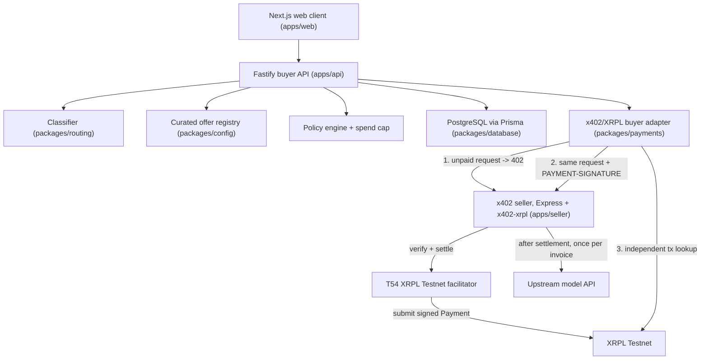

# SubBuddy

[](https://github.com/Reallyeasy1/Kevin/actions/workflows/ci.yml)

**One wallet. The right model for every task. Pay only when it is used.**

SubBuddy is a wallet-native AI inference router built for the Singhacks 2026 Ripple challenge, "Build an AI-Native Business on XRPL". A user (or, later, an agent) submits a prompt and a maximum spend. The agent classifies the task, compares purchasable inference offers, selects one under a request-scoped mandate, pays the seller through x402 settled on XRPL Testnet, and returns the model response together with a verifiable economic receipt.

> Testnet demo wallet, not production custody. The agent wallet is a server-controlled XRPL **Testnet** wallet holding no real-value funds. Its seed lives only in backend environment secrets. This is a prototype exception (PRD DEC-006, §15.1); production replaces it with client-side or delegated policy-gated signing (§15.4). Nothing here is a production non-custodial architecture.

## What it proves

A user or agent can buy the most suitable AI inference for a task without creating an account with the seller, holding prepaid credits, or supplying an API key to the seller. The buyer's per-seller credentials and balances are replaced by one wallet-backed, request-scoped purchase.

It does not prove that API keys vanish from the whole supply chain: a seller may still hold an upstream model credential behind its x402 gate, and the buyer holds one credential for prompt classification (DEC-014), with a deterministic fallback classifier if that fails.

## Problem

An agent can decide which AI capability it needs, but access is normally pre-provisioned: a human creates provider accounts, funds balances, obtains keys, and configures the agent before it can act.

```text
Dynamic agent decision + Static commercial access = Limited autonomy
```

SubBuddy replaces the buyer's provider-specific commercial relationship with a request-scoped payment:

```text
Need -> Discover -> Compare -> Authorise -> Pay -> Consume -> Verify
```

## Positioning

A prompt-aware economic routing layer that selects an inference offer and purchases it through an x402 payment settled on XRPL. The differentiation is buyer-controlled routing, inspectable decisions, request-scoped authorization, and direct settlement to an x402 seller. It is not a paywalled model aggregator with a token bolted on: remove the agent or remove autonomous payment and the product stops working.

## The market it draws from: XRPL AI Hub

The [XRPL AI Hub](https://xrpl-ai.org/) is the live directory of x402 services on XRPL, priced in XRP or RLUSD. SubBuddy is designed to draw its offers from that market (FR-021, P1 `XrplAiHubRegistry`). The MVP routes over a curated, version-controlled registry of three demo sellers because hub listings are Mainnet services and would yield no eligible Testnet offers under `APP_ENV=hackathon`. The `ProviderRegistry` interface is the seam; the hub-backed implementation slots in without touching routing or UI.

P1 is implemented as a build-time import: `packages/config/hub-offers.json` holds listings captured from the hub (endpoint, payTo, CAIP-2 network, asset, price, capabilities), and `XrplAiHubRegistry` normalises them into the FR-020 offer schema with `source: "xrpl-ai-hub"`, `hubServiceId` and `hubUrl`. Invalid records are skipped with a logged reason, only the configured network and settlement asset pass, and Mainnet listings are excluded under `APP_ENV=hackathon` (SEC-010). `MergedRegistry` is CuratedRegistry ∪ hub, deduplicated by endpoint with curated fields winning, versioned as one hash (INV-010); its `hubStatus` drives the "hub discovery unavailable" notice. Because every hub listing captured so far is Mainnet, the demo runs curated-only and shows that notice; point `hub-offers.json` at a Testnet x402 seller to watch the agent pick a hub-discovered offer.

## Architecture



Payment flow (PRD §7.2, amended to the x402 XRPL exact scheme):

1. Buyer sends the inference request to the top-ranked seller. Seller answers `402 Payment Required` without running inference. The requirement is stored as an immutable quote.
2. Policy engine approves the exact amount, asset, destination, network, invoice binding, and expiry against the user's mandate and the hourly spend cap.
3. Buyer signs one XRPL `Payment` (`InvoiceID = SHA-256(invoiceId)`, bounded `LastLedgerSequence`, no partial payment, no paths). The signed blob and its locally computed hash are persisted before anything leaves the process.
4. Buyer resends the identical request with `PAYMENT-SIGNATURE`. This single call is both the settlement trigger and the execution trigger.
5. Seller hands the payload to the facilitator, which verifies and submits to XRPL. Seller runs inference exactly once after settlement and returns the result with a `PAYMENT-RESPONSE` header carrying the tx hash.
6. Buyer independently confirms the hash is `tesSUCCESS` in a validated ledger, then and only then marks the payment `SETTLED`.

Retries resend the same blob; a quote is never signed twice. Details, state machines, and invariants: [docs/ARCHITECTURE.md](docs/ARCHITECTURE.md).

## Repository layout

```text
apps/web        Next.js + Tailwind single-page router UI, receipts, /history (paginated past routes from GET /v1/routes)
apps/api        Fastify buyer API: routes, policy gate, settlement state machine, SSE events
apps/seller     Express + x402-xrpl seller: 402 gate, facilitator settle, upstream model
packages/contracts   Zod wire schemas, route/payment state machines
packages/routing     classifier (LLM + deterministic fallback), eligibility, scoring, explanation
packages/payments    xrpl.js + x402-xrpl adapter behind PaymentClient / WalletSigner
packages/database    Prisma schema, repository, spend ledger, in-memory fake for tests
packages/config      env validation (SEC-010), curated offer registry, XRPL AI Hub import (hub-offers.json)
tests/acceptance     PRD §17 AT-001..AT-012 + NFR-001/004/005 through the buyer API wire contract
tests/fakes          fake x402 seller, fake ledger, recording signer/payment client, stub classifier
tests/e2e            mocked Playwright flows (route, history; no network)
scripts/             smoke-testnet.ts, the manual live Testnet smoke test (never on CI)
```

## Quick start (no wallet, no Docker)

```bash
pnpm install
pnpm typecheck
pnpm test
pnpm exec playwright install chromium   # once, first run only
pnpm test:e2e
```

These need only Node 22 + pnpm; `.env`, Postgres and Testnet wallets are only for running the live demo (next section).

## Setup

Prerequisites: Node 22, pnpm 11, Docker (live demo only, for Postgres).

```bash
pnpm install
cp .env.example .env            # then fill in the values below
# The dev:* and smoke:testnet scripts load .env automatically (scripts/with-env.mjs); shell variables take precedence.
pnpm db:up                      # docker compose up -d postgres (set POSTGRES_PORT in .env if 5432 is taken; keep DATABASE_URL in sync)
pnpm --filter @subbuddy/database generate
pnpm --filter @subbuddy/database db:migrate
```

`.env` is gitignored and never committed. Every variable is documented with a non-secret example in [.env.example](.env.example). The minimum you must change:

| Variable | What to set |
| --- | --- |
| `AGENT_WALLET_SEED` | Family seed of the funded Testnet agent wallet (buyer side only). |
| `SELLER_PAYTO_ADDRESS` | Classic address of the seller's Testnet wallet. |
| `RLUSD_ISSUER` | Testnet RLUSD issuer address (from the faucet page below). |
| `DEMO_API_KEY` / `NEXT_PUBLIC_DEMO_API_KEY` | The same long random string. Hackathon-only bearer key (SEC-011). |

Startup fails fast if `APP_ENV=hackathon` and any XRPL setting points at Mainnet (SEC-010).

### Fund the Testnet wallets

You need two Testnet accounts: the agent (buyer) wallet and the seller wallet. Both need XRP for reserves and fees; both need an RLUSD trust line to the Testnet issuer, and the agent wallet needs an RLUSD balance.

Shortcut: `pnpm fund:testnet` does steps 1 and 3 for both wallets and writes the seeds only to a gitignored `testnet-wallets.local.json`; you still fetch RLUSD (step 2) yourself.

1. Create and fund both accounts with Testnet XRP at the [XRP Testnet faucet](https://faucet.altnet.rippletest.net/) (or `xrpl.js` `client.fundWallet()`). Keep the seeds out of source; the agent seed goes in `.env` only.
2. Get Testnet RLUSD for the agent wallet from the [RLUSD Testnet faucet, tryrlusd.com](https://tryrlusd.com/) (listed in [ripple/resources.md](ripple/resources.md)). The faucet page shows the Testnet issuer address; copy it into `RLUSD_ISSUER`.
3. Set an RLUSD trust line from each wallet to the issuer. Receiving an issued currency requires one, so the seller cannot be paid without it:

```js
// node -e "$(cat)" < this snippet, with SEED and ISSUER from your terminal, never from source
import { Client, Wallet } from 'xrpl';
const c = new Client('wss://s.altnet.rippletest.net:51233'); await c.connect();
const w = Wallet.fromSeed(process.env.SEED);
await c.submitAndWait({
  TransactionType: 'TrustSet', Account: w.address,
  LimitAmount: { currency: '524C555344000000000000000000000000000000', issuer: process.env.ISSUER, value: '1000' },
}, { wallet: w, autofill: true });
await c.disconnect();
```

4. Check the balance with `GET /v1/wallet` once the API is running, or on the [Testnet explorer](https://testnet.xrpl.org/).

Fallback: set `SETTLEMENT_ASSET=XRP` to settle in Testnet XRP with no trust lines (DEC-005). This is a configuration change only.

## Run

Three processes, three terminals. Buyer and seller always talk over HTTP; the seller is never called in-process. Shortcut: `pnpm demo` (scripts/demo.mjs) starts Postgres, migrates, and runs all three with prefixed logs in one terminal; Ctrl+C stops them all.

```bash
pnpm dev:seller   # http://localhost:4020, x402 gate + facilitator
pnpm dev:api      # http://localhost:4010, buyer API
pnpm dev:web      # http://localhost:3000, UI (port busy? pnpm --filter @subbuddy/web exec next dev --webpack --port 3100)
```

With `CLASSIFIER_PROVIDER=mock` and `SELLER_UPSTREAM_PROVIDER=mock` (the defaults) the flow runs end to end with a deterministic classifier and a canned model answer, while the payment still goes through the real facilitator and XRPL Testnet. Set `SELLER_UPSTREAM_PROVIDER=openai-compatible` plus base URL and key on the seller side for real inference; set `CLASSIFIER_PROVIDER=anthropic` plus a key on the buyer side for LLM classification.

## Test

```bash
pnpm test         # Vitest: unit, mocked integration and PRD §17 acceptance tests, no network
pnpm exec playwright install chromium   # once, first run only
pnpm test:e2e     # Playwright: mocked route and /history flows through the real UI, against a production build (~1-2 min; WEB_PORT=3177 if 3000 is busy)
pnpm typecheck    # all packages, scripts/ and tests/
pnpm lint
```

Nothing in `pnpm test` or `pnpm test:e2e` touches XRPL, the facilitator, or an upstream model: xrpl.js clients, the facilitator client, and model calls are all replaced with fakes. One file (`packages/database/src/db.test.ts`, repository against Postgres, FR-071/AT-005) runs only when `DATABASE_URL` points at a reachable Postgres; it is skipped otherwise (shown as "1 skipped") and runs on CI against a real Postgres. CI runs exactly these (`.github/workflows/ci.yml`).

### Manual live Testnet smoke test (PRD §18.3)

Run this by hand before submission. It must never run on ordinary CI commits. The scripted version does steps 3 to 7 for you and prints the evidence rows; see [docs/LIVE_SMOKE.md](docs/LIVE_SMOKE.md) for what each step proves and how to troubleshoot:

```bash
pnpm dev:seller && pnpm dev:api          # two terminals, real Testnet .env
pnpm smoke:testnet -- 0.020000           # route, pay, verify on ledger (AT-011), re-execute (AT-005)
```

The UI walk-through:

1. Fund and configure wallets as above. Start seller, API, and web with real Testnet settings.
2. Open http://localhost:3000. Confirm the Testnet badge and a non-zero agent wallet balance.
3. Enter the demo prompt below, mode **Balanced**, max cost `0.020000` RLUSD. Press **Route and Run**.
4. Watch the timeline: classification, three candidates, selection, 402 quote, policy approval, signed, paid request sent, verifying, succeeded.
5. Expand the receipt. Copy the transaction hash and open the explorer link; confirm destination, amount, and asset match the receipt (AT-011).
6. Press execute again or refresh the page and re-execute the same route. Confirm no second payment is created and the same hash is returned (AT-005).
7. Open **History**: the route appears with its state, quoted vs settled amount and the explorer link (US-010).
8. Record the evidence in [docs/EVIDENCE.md](docs/EVIDENCE.md).

| Run | Date (UTC) | Route ID | Tx hash | Explorer link | Amount / asset | Result |
| --- | --- | --- | --- | --- | --- | --- |
| Happy path | 2026-09-05 04:48:42 | `b88803e3-53ea-43a2-836b-a4c35ded6eb5` | `4F930E96D76AF9D6F0D7696B168D017EBE463A0F7ED0584CAC06DD4248909C4D` | https://testnet.xrpl.org/transactions/4F930E96D76AF9D6F0D7696B168D017EBE463A0F7ED0584CAC06DD4248909C4D | 0.006000 RLUSD | `tesSUCCESS`, ledger 20496465 |
| Duplicate execute | 2026-09-05 04:48:42 | same as above | same as above | same as above | no new payment | 202, state SUCCEEDED, same hash |

## Demo script (PRD §22)

Presenter checklist with exact commands, per-step expected screen state, and an "if something breaks" table: [docs/DEMO.md](docs/DEMO.md). The market the router draws from is the [XRPL AI Hub](https://xrpl-ai.org/), the live x402 directory with 1,700+ registered providers; its listings are Mainnet, so on Testnet three curated offers stand in and the UI shows the "Hub discovery unavailable" notice (FR-021).

1. **Setup.** Show the XRPL Testnet badge, the funded agent wallet balance, the four routing modes, and the maximum-cost control.
2. **Prompt.** Mode Balanced, max cost `0.020000 RLUSD`:
   > Explain this distributed database query plan and identify the most expensive operation. Keep the answer under 500 words.
3. **Agent decision.** Show the classification (technical reasoning or long-context analysis), the three considered offers, one excluded or lower-ranked alternative, the selected offer's score factors, and the registry estimate next to the authoritative quote.
4. **Commercial loop.** Narrate only what is on screen: seller requested payment; policy confirmed the quote was within the mandate; agent signed one exact Testnet payment; XRPL validated it; seller released the purchased inference. ([docs/screenshots/04-timeline.png](docs/screenshots/04-timeline.png))
5. **Evidence.** Show the answer, expand the economic receipt, open the transaction in the Testnet explorer, then repeat execute to show no second payment occurs. ([docs/screenshots/05-receipt.png](docs/screenshots/05-receipt.png); all seven §22 screenshots and their transaction are in [docs/EVIDENCE.md](docs/EVIDENCE.md).)

No platform commission is executed or displayed anywhere in the MVP (DEC-007, INV-008).

## Builder feedback

Two parts, both required by the challenge:

- The XRPL feedback Stop hook (`ripple/hook/`) is registered in `.claude/settings.json` and stayed on for the whole build, from scaffolding through the live Testnet runs. Every sampled turn that surfaced concrete XRPL or tooling friction (xrpl.js, x402-xrpl, the facilitator, RLUSD faucets) was submitted through it; the hackathon server keeps the count. Manual submit: `node ripple/hook/submit.mjs --text "<one specific paragraph>"`.
- Final feedback form, submitted near the end of the hackathon: https://forms.gle/FZckiEAMU8oWXVbX7

Definition-of-done checklist with per-bullet evidence pointers: [docs/DOD.md](docs/DOD.md). CI history: [Actions](https://github.com/Reallyeasy1/Kevin/actions/workflows/ci.yml).

## Further reading

- [PRD_SPECS.md](PRD_SPECS.md), the source of truth; every P0 behaviour has a requirement ID.
- [docs/ARCHITECTURE.md](docs/ARCHITECTURE.md), adapter boundaries, state machines, invariants, what is mocked vs live.
- [docs/EVIDENCE.md](docs/EVIDENCE.md), transaction hashes, explorer links, screenshots.
- [docs/DEMO.md](docs/DEMO.md), presenter rehearsal checklist; [docs/DOD.md](docs/DOD.md), PRD §21 checklist with evidence; [docs/LIVE_SMOKE.md](docs/LIVE_SMOKE.md), the manual Testnet smoke test.
- [ripple/README.md](ripple/README.md) and [ripple/resources.md](ripple/resources.md), the challenge brief and tool list.
