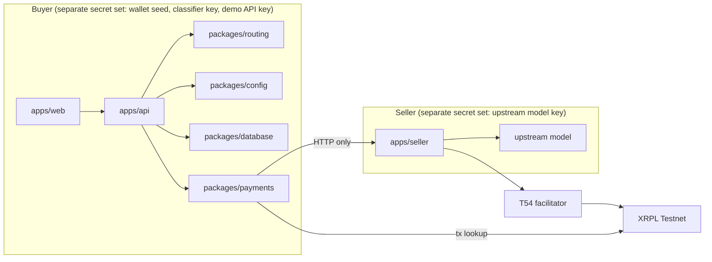
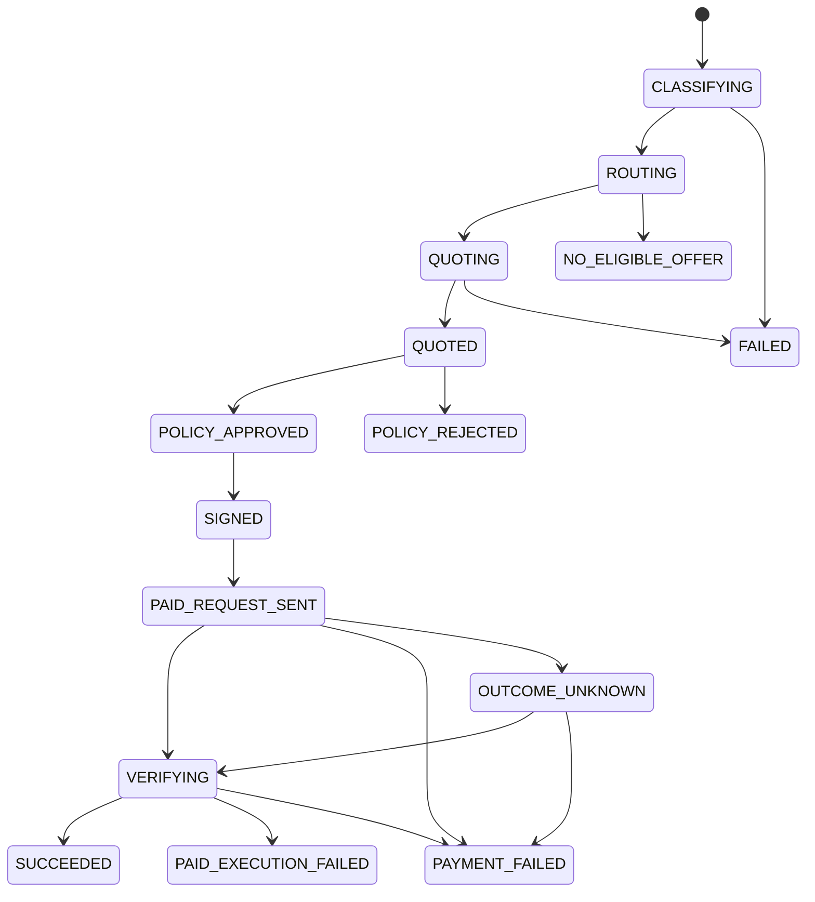

# Architecture

Companion to [PRD_SPECS.md](../PRD_SPECS.md) §9 and §10. The PRD wins on any disagreement.

## Components



Buyer and seller run as separate processes with separate secrets and talk only over HTTP, even in local development. Calling the seller in-process would bypass the x402 commercial boundary (PRD §10.1).

## Adapter boundaries (PRD §10.3)

External SDK types stay inside their package. Routing, API, and UI code see only these interfaces from `@subbuddy/contracts`:

| Interface | Implementations | Where SDKs are allowed |
| --- | --- | --- |
| `Classifier` | `LlmClassifier` (Anthropic or OpenAI-compatible over `fetch`), `FallbackClassifier` (deterministic) | `packages/routing/src/classifier.ts` |
| `ProviderRegistry` | `CuratedRegistry` (MVP); `XrplAiHubRegistry` validates hub listings fetched live from `HUB_URL/api/listings` at startup (apps/hub stands in for xrpl-ai.org; FR-021) or, when `HUB_URL` is unset or the fetch fails, the `packages/config/hub-offers.json` import; `MergedRegistry` = curated ∪ hub deduped by endpoint. | `packages/config/src/registry.ts`, `packages/config/src/hub.ts` |
| `PaymentClient` | `X402PaymentClient`: `obtainRequirement`, `payAndRetry`, `resolveTransaction` | `packages/payments` (xrpl.js, x402-xrpl) |
| `WalletSigner` | `XrplWalletSigner`: `getAddress`, `signExactPayment` | `packages/payments/src/signer.ts` |

Other seams:

- `packages/database` exports a `Repository` and `SpendLedger` over Prisma, plus `createFakeDb()` so the API test suite runs without Postgres.
- The seller uses `x402-xrpl`'s `FacilitatorClient` directly; it is the only place the facilitator is called. Tests inject a fake with `verify` and `settle`.
- The registry is the SEC-003 allowlist. Every outbound `endpoint` and `payTo` must equal a registry value; user input never reaches `fetch`.

## Request lifecycle

1. `POST /v1/routes` (bearer `DEMO_API_KEY`): validate mandate, classify, load registry, filter, score, persist route and candidates. No network to sellers yet.
2. `POST /v1/routes/:id/execute`: prompt hash must match. Lock the route row (SEC-007). Send the unpaid request to the top candidate, expect 402, store the immutable quote. Try the next eligible candidate on rejection or over-budget quote, bounded to `MAX_QUOTE_ATTEMPTS = 3` attempts (§14); on exhaustion the route fails with the last quote failure's code (AT-004).
3. Policy gate: mandate active, balance sufficient, network/asset match, destination allowlisted, amount within mandate, no existing payment, hourly spend cap not exhausted, expiry leaves time to submit. A rejection never touches the signer.
4. Sign once (serialised per wallet), persist blob and hash, then resend with `PAYMENT-SIGNATURE`.
5. Seller: facilitator `verify`, then `settle`, then upstream model once per invoice, then respond with `PAYMENT-RESPONSE`.
6. Buyer: `resolveTransaction(hash)` against the ledger. `SETTLED` only on validated `tesSUCCESS`.
7. `GET /v1/routes/:id/events` streams state changes; `GET /v1/routes/:id` returns the receipt without seed, keys, or signed blob.

## State machines (PRD §9)

### Route states



`PAID_REQUEST_SENT` covers the seller call that both settles and executes. `VERIFYING` is the buyer's independent ledger check of the hash from `PAYMENT-RESPONSE` (or the locally computed hash if the response was lost). `SUCCEEDED` requires a validated `tesSUCCESS` and a model result; `PAID_EXECUTION_FAILED` requires a validated `tesSUCCESS` and no result. If the ledger shows no such transaction after `LastLedgerSequence` has passed, the route is `PAYMENT_FAILED` and no money moved.

### Payment states

```text
NOT_CREATED
-> CREATED
-> SIGNED            (blob + hash persisted; the only signing event)
-> SENT              (blob handed to the seller in PAYMENT-SIGNATURE)
-> SETTLED           (buyer saw tesSUCCESS in a validated ledger)

Failure branches:
CREATED -> POLICY_REJECTED
SENT    -> VALIDATED_FAILED   (tec/tef/tem result, or expired past LastLedgerSequence with no ledger entry)
SENT    -> OUTCOME_UNKNOWN    (seller/facilitator response lost; resolve by hash, never re-sign)
```

The facilitator, not the buyer, submits to XRPL. The buyer's replay protection is the account `Sequence` inside the signed blob: resending the same blob cannot apply twice, and a fresh signature is never produced for an existing quote.

Transitions are encoded in `packages/contracts/src/state-machine.ts` and tested there.

## Invariants (PRD §9.3) and where they are enforced

| ID | Invariant | Enforcement |
| --- | --- | --- |
| INV-001 | No upstream inference before payment verification. | `apps/seller/src/app.ts`: upstream is called only after facilitator `settle` succeeds (AT-012). |
| INV-002 | No signing before policy approval. | `apps/api/src/service.ts`: signer is reached only from the `POLICY_APPROVED` branch. |
| INV-003 | At most one submitted payment per invoice or route. | Prisma `Payment`: `UNIQUE(routeId)`, `UNIQUE(quoteId)`, `UNIQUE(invoiceId)`, `UNIQUE(transactionHash)`; row lock on execute (SEC-007). |
| INV-004 | A settled route is never automatically rerouted to a newly paid offer. | Candidate retry loop stops at the first signature; `PAID_EXECUTION_FAILED` is terminal for the route. |
| INV-005 | Quoted amount, asset, destination, network, invoice binding are immutable. | `Quote` row written once; `assertExactMatchesRequirement` re-checks every field immediately before signing (SEC-005). |
| INV-006 | Money is decimal strings or `decimal.js`, never floats. | Zod decimal-string schemas in `contracts`; `decimal.js` in routing, api, payments. |
| INV-007 | Wallet seed and upstream credentials never leave server env. | Seed read from env inside `signExactPayment` only; Pino redaction (SEC-001); receipts strip blob and secrets (SEC-009). |
| INV-008 | No platform commission payment. | No code path builds a second `Payment`; no fee row in UI. |
| INV-009 | Only a validated `tesSUCCESS` produces `SETTLED`. | `classifySettlement` in `packages/payments/src/client.ts`; facilitator acknowledgment alone is ignored. |
| INV-010 | Same inputs and registry version give the same candidate ordering. | Registry sorted by `offerId` and hashed; scoring is deterministic with fixed tie-breaks. |
| INV-011 | A quote is signed at most once; retries resend the identical blob. | Signed blob persisted before send; `payAndRetry` and outcome resolution reuse it, never call the signer. |
| INV-012 | No signing without a valid demo API key and unexhausted hourly cap. | Fastify auth hook (SEC-011) and `SpendLedger` check before the signer. |

## Mocked vs live

| Concern | `pnpm test` / CI | `pnpm test:e2e` | Dev run, default env | Live smoke test |
| --- | --- | --- | --- | --- |
| XRPL ledger (xrpl.js) | fake `LedgerHandle` | not reached (API mocked by `page.route`) | live Testnet | live Testnet |
| Facilitator | `vi.fn` verify/settle | not reached | live T54 Testnet facilitator | live |
| Wallet signing | fake signer or fixed test seed, no network | not reached | real signature, live seed from env | real |
| Seller HTTP | `fetch` stub | not reached | live HTTP to `apps/seller` | live |
| Upstream model | `mockUpstream()` | not reached | `mockUpstream()` unless configured | real if `SELLER_UPSTREAM_PROVIDER=openai-compatible` |
| Classifier | `FallbackClassifier` or stubbed `fetch` | not reached | `mock` (deterministic) | `anthropic` or `openai-compatible` if configured |
| Database | `createFakeDb()` in-memory | not reached | Postgres via Docker | Postgres |
| Offer registry (FR-021) | curated seed + hub listings; live from `HUB_URL/api/listings` (apps/hub dummy hub on 4030: 4 Testnet listings priced by the seller, `hubStatus.source='live'`), else the `hub-offers.json` import (all Mainnet, excluded under `APP_ENV=hackathon`, so curated-only with `hubStatus.available=false` and the reason) | mocked fetch (success / timeout / invalid skip) | live dummy hub | live dummy hub (`pnpm dev:hub` + `HUB_URL`) |

Rule: live Testnet tests are manual and never run on ordinary CI commits (PRD §18.3). Evidence from them is recorded by hand in [EVIDENCE.md](EVIDENCE.md).

## Security boundary

Testnet demo wallet, not production custody (PRD §15.1). The seed is server-side env, destinations are allowlisted, every request passes the policy gate, Mainnet config is rejected while `APP_ENV=hackathon` (SEC-010), and the buyer API requires the demo bearer key plus an hourly spend cap (SEC-011). The demo key is compiled into the browser bundle for the single-page UI; production replaces it with a real session and the demo wallet with client-side or delegated policy-gated signing (§15.4).
