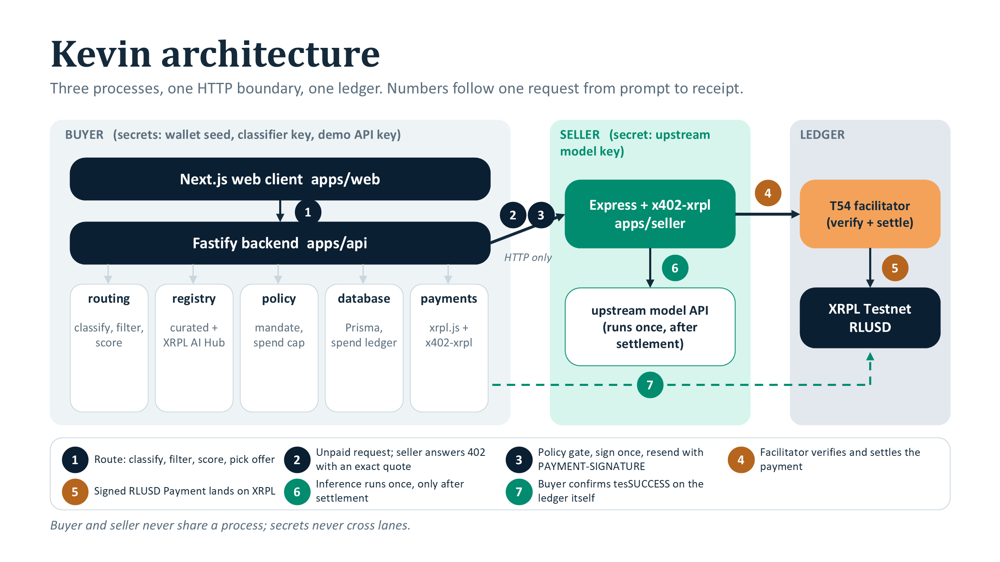

# Submission write-up

Paste-ready text for the Singhacks 2026 Ripple challenge form ("Build an AI-Native Business on XRPL"). Each section is one form field. Sources: [README.md](../README.md), [EVIDENCE.md](EVIDENCE.md), [ARCHITECTURE.md](ARCHITECTURE.md), [DEMO.md](DEMO.md), [PRD_SPECS.md](../PRD_SPECS.md).

## Submission checklist (brief, "Submission & Demo")

| Required item | Where it is covered |
| --- | --- |
| Clear articulation of the customer problem | [Problem](#problem); README "Problem" |
| Clear representation of the proposed product or service | [Project name and one-line pitch](#project-name-and-one-line-pitch); [What we built](#what-we-built-and-what-the-demo-proves) |
| Explanation of how the AI agent creates value | [How the AI agent creates value](#how-the-ai-agent-creates-value) |
| Demonstration of the core customer journey | [2-minute demo narration](#2-minute-demo-narration); [DEMO.md](DEMO.md); `screenshots/01-setup.png` to `07-duplicate.png` |
| Demonstration of the agentic transaction flow | [How XRPL and x402 are used](#how-xrpl-and-x402-are-used); `screenshots/03-quote.png`, `04-timeline.png`, `05-receipt.png` |
| At least one successful XRPL transaction | [Evidence](#evidence): `4F930E96…909C4D` (ledger 20496465), `89F5643E…C506E6` (ledger 20496719) |
| Explanation of the XRPL AI Starter Kit integration | [XRPL AI Starter Kit integration](#xrpl-ai-starter-kit-integration) |
| Explanation of how x402 is used | [How XRPL and x402 are used](#how-xrpl-and-x402-are-used) |
| Architecture diagram | [Architecture](#architecture): `architecture.png`, README mermaid flowchart, [ARCHITECTURE.md](ARCHITECTURE.md) state diagrams |
| Transaction hashes or explorer references | [Evidence](#evidence); [EVIDENCE.md](EVIDENCE.md) |

## Project name and one-line pitch

**Kevin**

One wallet. The right model for every task. Pay only when it is used.

Technical positioning (PRD §3.3): a prompt-aware economic routing layer that selects an inference offer and purchases it through an x402 payment settled on XRPL. Buyer-controlled routing, inspectable decisions, request-scoped authorization, direct settlement to an x402 seller. Remove the agent or remove autonomous payment and the product stops working.

## Problem

An agent can decide which AI capability it needs, but commercial access is static: a human must open provider accounts, fund balances, obtain API keys and configure the agent before it can act. Dynamic decisions plus static access equals limited autonomy. Kevin replaces the buyer's per-seller relationship (account, credits, key) with one wallet-backed, request-scoped purchase: Need -> Discover -> Compare -> Authorise -> Pay -> Consume -> Verify.

## How the AI agent creates value

Without the agent, the product is a paywalled endpoint: a human picks one vendor, configures its key, and every task goes there at that vendor's price. The agent turns each request into an inspectable economic decision:

1. **Classifies** the prompt into a task profile (task type, context size, tool needs) with an LLM and a deterministic fallback.
2. **Discovers and filters** purchasable offers from the registry; every rejected offer carries a reason code (`CAPABILITY_MISSING`, `ESTIMATED_COST_EXCEEDS_MAX`, `DESTINATION_NOT_ALLOWLISTED`, ...).
3. **Scores** the survivors on quality, cost, latency and reliability with the weights of the chosen mode. In the recorded run (task `coding`, mode Balanced) Fast Code scored 0.7780 and was selected over Deep Reasoning at 0.5090; Fast Text was ineligible. Same inputs and registry version always give the same order.
4. **Authorises** the seller's exact 402 quote against the user's mandate and spend cap before any signature exists.
5. **Pays exactly once**, then **verifies** settlement on the ledger itself, and returns the answer with a receipt that shows every one of these steps.

The value to the customer: the right model for each task instead of one model for everything, no onboarding with any seller, a hard ceiling per request instead of a monthly cap per vendor, and a per-call receipt on a public ledger. The value to sellers: paying customers with no accounts, credits or key management to run.

## What we built and what the demo proves

A TypeScript monorepo with three processes: a Next.js UI, a Fastify buyer API (classifier, offer registry, policy engine, spend cap, settlement state machine, SSE timeline, receipts, history) and an Express x402 seller gated by `x402-xrpl`. The user enters a prompt and a maximum spend in RLUSD. The agent classifies the task, ranks three purchasable offers, fetches the authoritative price from the top seller's HTTP 402, checks it against the mandate, signs exactly one XRPL Payment, resends the request with `PAYMENT-SIGNATURE`, independently confirms the transaction on the ledger, and shows the answer with an economic receipt (route id, prompt hash, classification, policy checks, tx hash, explorer link).

The demo proves that a buyer can purchase inference from an x402 seller with no seller account, no prepaid credits and no API key on the buyer side, and that the payment is real, exact, verifiable and cannot be duplicated: re-executing the same route returns 202 with the same hash and no new payment. Honest scope: the default seller returns a canned model answer (a real upstream model is one env setting away, `SELLER_UPSTREAM_PROVIDER=openai-compatible`), and the three demo sellers are operated by the team on Testnet because the live hub listings are Mainnet.

## How XRPL and x402 are used

- Settlement asset: RLUSD on XRPL Testnet (issuer `rQhWct2fv4Vc4KRjRgMrxa8xPN9Zx9iLKV`); Testnet XRP is a configuration-only fallback.
- Flow: seller answers `402 Payment Required` with the exact scheme requirement (amount, asset, payTo, network, invoice id, expiry) without running inference. The buyer's policy engine approves it, the agent signs one XRPL `Payment` (`InvoiceID = SHA-256(invoiceId)`, bounded `LastLedgerSequence`, no partial payment, no paths) and resends the identical request with `PAYMENT-SIGNATURE`. The seller passes it to the T54 XRPL Testnet facilitator, which verifies and settles (submits to XRPL), then runs inference exactly once per invoice and returns `PAYMENT-RESPONSE` with the tx hash.
- Ledger verification before success: the buyer looks the hash up on XRPL itself and marks the payment `SETTLED` only on a validated `tesSUCCESS`. A seller's 200 alone is never enough.
- No commission: one Payment, buyer to seller, no platform fee leg anywhere in code, receipt or UI (DEC-007, INV-008).
- Mainnet configuration is rejected at startup and in every adapter while `APP_ENV=hackathon` (SEC-010).

## Evidence

- Repository: https://github.com/Reallyeasy1/Kevin
- Live Testnet payment (happy path, AT-001/AT-011): tx `4F930E96D76AF9D6F0D7696B168D017EBE463A0F7ED0584CAC06DD4248909C4D`, ledger 20496465, 0.006000 RLUSD from agent wallet `rMdiYvvzXMhZvkTkPX9Kma7F61o6m4r5e3` to seller `r9jnMEauwP4Mh3dfAHNdSjFM4yiYGmsoUD`, `tesSUCCESS`. Explorer: https://testnet.xrpl.org/transactions/4F930E96D76AF9D6F0D7696B168D017EBE463A0F7ED0584CAC06DD4248909C4D
- UI demo run with all seven PRD §22 screenshots and duplicate-execute proof (AT-005): tx `89F5643E4F083E7BFACA72CDAEC37B4924A0147B81F0CEE58193408DE9C506E6`, ledger 20496719. https://testnet.xrpl.org/transactions/89F5643E4F083E7BFACA72CDAEC37B4924A0147B81F0CEE58193408DE9C506E6
- Both hashes were independently re-verified by a judge via Testnet JSON-RPC: validated, `tesSUCCESS`, Payment of 0.006 RLUSD, `InvoiceID` matching the receipt, no commission leg.
- CI: green on `main` (https://github.com/Reallyeasy1/Kevin/actions/workflows/ci.yml); typecheck, lint, Vitest against a real Postgres, Playwright e2e.
- Tests: `pnpm test` = 36 files passed, 1 skipped (Postgres-only, runs on CI); 202 tests passed, 3 skipped. `pnpm test:e2e` = 3 Playwright flows passed. PRD §17 acceptance tests AT-001..AT-012 all covered (automated or live), see [EVIDENCE.md](EVIDENCE.md).
- Fresh clone with no `.env` and no Docker reaches green typecheck, tests, e2e and lint in under five minutes.

## Architecture

Three processes, one HTTP boundary, one ledger; the numbers follow one request from prompt to receipt. Component and state diagrams: [ARCHITECTURE.md](ARCHITECTURE.md). In five sentences:

A Next.js client talks to a Fastify buyer API, which owns classification (LLM with deterministic fallback), the version-controlled offer registry that doubles as the payTo/endpoint allowlist, the policy engine with an hourly spend cap, and a persisted route/payment state machine in PostgreSQL via Prisma. The buyer's x402 adapter (xrpl.js plus x402-xrpl behind `PaymentClient` and `WalletSigner` interfaces) talks to the Express seller only over HTTP, even locally, so the commercial boundary is never bypassed. The seller's `x402-xrpl` middleware returns 402, hands `PAYMENT-SIGNATURE` payloads to the T54 facilitator for verify and settle, and calls the upstream model once per invoice only after settlement. The buyer persists the signed blob and its locally computed hash before anything leaves the process, resends the identical blob on retries, and independently resolves the hash on XRPL before marking `SETTLED`. The `ProviderRegistry` seam already carries an `XrplAiHubRegistry` that imports xrpl-ai.org listings, so the hub market plugs in without touching routing or UI.

## Security and safety

Testnet demo wallet, not production custody: the agent wallet is a server-controlled XRPL Testnet wallet holding no real-value funds; its seed lives only in backend environment secrets and never in source, logs, receipts or screenshots (PRD DEC-006, §15.1; production replaces it with client-side or delegated policy-gated signing, §15.4). Enforced invariants: INV-002 no signing before policy approval (the signer is reachable only from the `POLICY_APPROVED` branch); INV-003 at most one payment per invoice or route (`UNIQUE` on routeId, quoteId, invoiceId and transactionHash plus a row lock on execute); INV-009 only a validated `tesSUCCESS` on the ledger produces `SETTLED`; INV-011 a quote is signed at most once and every retry resends the identical blob. Destinations and endpoints are allowlisted at three layers (quote validation, policy, pre-sign check against the stored quote). The buyer API requires a demo bearer key and an hourly spend cap (SEC-011); money is decimal strings only; Pino redacts seeds, signatures and payment headers. An independent payment-skeptic review found no path that moves money to the wrong place, for the wrong amount, twice, or on Mainnet in hackathon mode.

## XRPL AI Starter Kit integration

We used the kit's x402 pieces for the seller and the transport, and xrpl.js directly for the buyer's signing and verification.

- **`x402-xrpl` 0.3.2** (the kit's x402 reference implementation for XRPL). Seller side, `apps/seller/src/app.ts`: `requireX402` from `x402-xrpl/express` gates every inference route, returns the 402 with an exact-scheme `PaymentRequirements`, and hands `PAYMENT-SIGNATURE` payloads to the facilitator. We implement its `InvoiceStore` interface (invoice bound to offer, request id and prompt hash) and use `invoiceIdFactory` so the invoice id is known before the 402 goes out and can be bound on ledger via `InvoiceID`. Buyer side, `packages/payments`: the SDK's header codecs (`PAYMENT-SIGNATURE`, `PAYMENT-RESPONSE`) and its `XRPLNetworkId` type, checked at compile time against our own network constant.
- **T54 XRPL Testnet facilitator** (`FACILITATOR_URL`, `FacilitatorClient` from the SDK): `verify` then `settle`; the facilitator submits the signed Payment to XRPL. The seller calls upstream only after `settle` succeeds. Tests inject a fake facilitator.
- **xrpl.js 4.6.0**: the buyer builds and signs the exact `Payment` itself (`InvoiceID = SHA-256(invoiceId)`, bounded `LastLedgerSequence`, `SendMax` for the RLUSD IOU, no partial payment, no paths), persists blob and hash before sending, and resolves the hash on Testnet before marking `SETTLED`. We kept this on raw xrpl.js so the policy gate sits between "sign" and "send".
- **`xrpl-agentic-resources` skill** from the challenge repo, vendored at `.claude/skills/xrpl-agentic-resources/`: the xrpl.org index, live amendment and fee snapshots, and the x402 docs index that the coding agent pulled from during the build.
- Not used: MPP; the XRP settlement fallback (`SETTLEMENT_ASSET=XRP`) is configuration only and was not exercised live.

## XRPL AI Hub relationship (FR-021)

The XRPL AI Hub (https://xrpl-ai.org/) is the live directory of x402 services on XRPL priced in XRP or RLUSD, and it is the market Kevin is designed to draw offers from. `XrplAiHubRegistry` imports hub listings from `packages/config/hub-offers.json`, normalises them into the offer schema with `source: "xrpl-ai-hub"`, and `MergedRegistry` unions them with the curated registry, deduplicated by endpoint and versioned as one hash. Every listing captured so far is a Mainnet service, which this build rejects under `APP_ENV=hackathon`, so the demo routes over three curated Testnet sellers and the UI shows the "Hub discovery unavailable" notice. Point `hub-offers.json` at a Testnet x402 seller and the agent picks a hub-discovered offer with no other change.

## Builder feedback

The XRPL feedback Stop hook (`ripple/hook/`) was registered in `.claude/settings.json` and stayed on for the whole build, from scaffolding through the live Testnet runs. Every sampled turn that surfaced concrete XRPL or tooling friction (xrpl.js, x402-xrpl, the T54 facilitator, the RLUSD Testnet faucet and trust-line setup) was submitted through it; the hackathon server holds the count. Final feedback form: https://forms.gle/FZckiEAMU8oWXVbX7

## 2-minute demo narration

(0:00) "Kevin is a wallet-native AI inference router. One Testnet wallet, no seller accounts, no API keys on the buyer side. The agent picks the model and pays per request over x402 on XRPL. Everything you see is XRPL Testnet from a demo wallet with no real-value funds." Point at the Testnet badge, the wallet balance, the four modes, the max-cost field. "The live market is the XRPL AI Hub, 1,700+ providers; those listings are Mainnet, which this build rejects, so three curated Testnet sellers stand in."

(0:25) Paste the prompt: "Explain this distributed database query plan and identify the most expensive operation. Keep the answer under 500 words." Mode Balanced, max cost 0.020000 RLUSD. "A mid-tier task, budget two cents." Click Route and Run.

(0:40) Timeline ticks through Classify, Compare, Quote. "The agent compared three offers and picked the best quality-per-price for this task. The estimate came from our registry; the quote is authoritative, it came from the seller's HTTP 402, and the policy engine checked it against the mandate before anything was signed."

(1:00) Approve, Settle, Execute. "Seller requested payment. Policy confirmed amount, asset, destination, network, invoice binding and expiry. The agent signed one exact Testnet payment, the facilitator submitted it, XRPL validated it. Only after validation did the seller release the inference."

(1:25) Answer and payment card appear. Expand the receipt. "0.006 RLUSD to the seller, hash, ledger index, policy checks all ok, payment SETTLED. No fee row: no platform commission, one payment, buyer to seller." Click View on explorer. "Same hash, same destination, same amount. The buyer verified this on the ledger itself before marking it settled."

(1:45) Reload the route via `/?route=<id>` or re-POST execute. "Replaying the route cannot create a second payment: one signature per quote, one payment per route, enforced by database uniqueness and a row lock. Same hash, balance down exactly 0.006."

(2:00) "One wallet, the right model for the task, paid only when used, verifiable on XRPL."

## Team

Team **LookingForEmployment**, Singhacks 2026, Ripple challenge "Build an AI-Native Business on XRPL".
